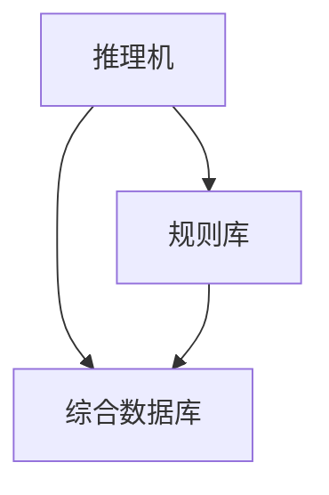
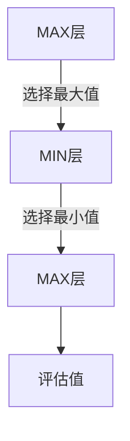

> 人工智能基础 2025 春季学期的重点，来源于[计算机速通之家 | QQ 群号：468081841](https://qm.qq.com/q/ojSHMvHG5a)。
>
> 重点也是融合版，包含了重点内容和猫雷最后一课的部分内容。
>
> 笔记摘抄于课本和PPT，课本和PPT下载链接在文章末尾。
>
> 本文连载于[人智基础 - 2025sp - 重点笔记 | HeZzz](https://hez2z.github.io/2025/07/07/%E4%BA%BA%E6%99%BA%E5%9F%BA%E7%A1%80-2025sp-%E9%87%8D%E7%82%B9%E7%AC%94%E8%AE%B0/),网页端查看会比 PDF 爽一点。
>
> 计算题我就先不写了，后面有时间可能会补上（大概率没时间了），我主要把概念题的部分找一下，计算题米娜桑自己做吧。

🙇‍♂️🙇‍♂️🙇‍♂️时间仓促，有不足之处烦请及时告知。[邮箱hez2z@foxmail.com](mailto:hez2z@foxmail.com) 或者在 [速通之家](https://qm.qq.com/q/ojSHMvHG5a) 群里 `@9¾`。

---

## 考试题型及分值分布 (总计：100分)

* **第一大类：简答题 (40分)**
  * 6道小题，分值不等（每题5分或8分）
  * 最少5分/题，最多8分/题
* **第二大类：计算题 (25分)**
  * 3道题目
* **第三大类：证明题 (15分)**
  * 2道题目
* **第四大类：综合题 (20分)**
  * 2道题目（考察对算法的综合理解）

## 第一章

* ~~智能的定义（什么是智能，人工智能）（猫雷说不考）~~
* 人工智能的学派（特点，优缺点，主张，模型…）

### 智能的概念（大概不考）

“智能” 是知识和智⼒的综合。
智能具有下列特征：

1. 感知能⼒：⼈们通过感知器官感知外部世界的能⼒；
2. 记忆和思维能⼒：⼈脑最重要的功能，也是⼈类智能最主要的表现形式；
最主要的表现形式：
3. 学习和⾃适应能⼒：⼈类的本能；
4. ⾏为能⼒：⼈们对感知到外界信息做出动作反应的能⼒。

### ⼈⼯智能的概念(大概不考)

⼈⼯智能，就是⼈类智能的⼈⼯实现。具体来说，是指机器根据⼈类给定的初始信息来⽣成和
调度知识、进⽽在⽬标引导下由初始信息和知识⽣成求解问题的策略并把智能策略转换为智能
⾏为从⽽解决问题的能⼒。

最终⽬标 —— 建⽴关于智能的理论和让智能机器达到⼈类的智能⽔平（⼈⼯智能体）。

### 人工智能的学派

* **符号主义（谓词逻辑）**：**AI研究的传统观点，强调物理符号系统**。
* **连接主义（深度神经网络）**：**又称仿生学派，强调神经元的运作**。
* **行为主义（强化学习）**：智能行为的基础是“**感知-行动**”，是在与环境的交互作用中表现出来的。

1. 符号主义的主要特征和缺点

    主要特征：

    1. 立足于**逻辑运算和符号操作**,适合于模拟人的逻辑思维过程,解决需要逻辑推理的复杂问题。
    2. 知识可用**显示的符号**表示,在已知基本规则的情况下,无需输入大量的细节知识。
    3. 便于模块化,当个别事实发生变化时,易于修改。
    4. 能与传统的符号数据库进行连接。

    缺点：

    1. 有时体现的是“暴力”的思想(四色定理的证明)。
    2. 可以解决逻辑思维,但对于形象思维难于模拟。

2. 连接主义的主要特征和缺点

    主要特征:

    1. 通过神经元之间的并行协作实现信息处理,处理过程具有**并行性,动态性,全局性**。
    2. 可以实现**联想**的功能,便于对有**噪声**的信息进行处理。
    3. 可以通过对神经元之间**连接强度**的调整实现**学习和分类**等。
    4. 适合模拟人类的**形象思维**过程。
    5. 求解问题时,可以较快的得到一个**近似解**。

    缺点：

    1. 不适合于解决逻辑思维
    2. 黑盒
    3. 费用高

3. 符号主义和连接主义的对比

* 符号主义：AI研究的传统观点 ，强调物理符号系统。
* 连接主义：又称仿生学派，强调神经元的运作。

|              | 符号主义       | 联接主义                         |
| ------------ | -------------- | -------------------------------- |
| 智能产生于   | 符号运算       | 大量简单元素的并行分布式联接之中 |
| 智能基本单元 | 符号           | 简单元素的相互联接               |
| 智能行为     | 符号运算的结果 | 联接计算的结果                   |
| 思维方式     | 抽象思维       | 形象思维                         |

---

## 第二章

* 谓词公式表示知识,谓词逻辑
* 产生式系统的构成（各部分作用）
* **语义网络表示知识（必考）**（连词量词的表示）

> 这里大部分都是计算题，所以省了一部分笔记。

### 产生式系统的组成

把一组产生式放在一起，让他们互相配合，协同作用，一个产生式生成的结论可以供另一个产生式作为已知事实使用，以求得问题的解决，这样的系统称为产生式系统。

一般说来，一个产生式系统由以下三个基本部分组成：

* **推理机**

    推理机用来控制和协调规则库与综合数据库的运行，包含了控制策略和推理方式。通常从选择规则到执行操作分3步完成：**匹配、冲突解决和操作**。

* **规则库**

    用于描述某领域内知识的产生式集合，是**某领域知识(规则)的存储器**，其中的规则是**以产生式形式表示**的。规则库中包含着将问题从初始状态转换成目标状态(或解状态)的那些变换规则。

    **规则库是专家系统的核心**，也是一般产生式系统赖以进行问题求解的基础，其中知识的完整性和一致性、知识表达的准确性和灵活性以及知识组织的合理性，都将对产生式系统的性能和运行效率产生直接的影响。

* **综合数据库**

    综合数据库又称为**事实库**，用于存放输入的事实、从外部数据库输入的事实以及中间结果(事实)和最后结果的工作区。当规则库中的某条产生式的前提可与综合数据库中的某些已知事实匹配时，该产生式就被激活，并把用它推出的结论放入综合数据库中，作为后面推理的已知事实。

    显然，**综合数据库的内容是在不断变化的**，是动态的。

---

## 第三章

* **归结演绎推理**（重要）
* 谓词演算等价式、子句和子句集、子句集化简、鲁滨逊归结原理、置换合一、归结反演
* 化子句集或证明题

> 这没概念题啊。

---

## 第四章

* 状态空间（知道概念）
* 盲目搜索（宽度、深度）（**OPEN表**、CLOSE表动态变化情况）
* **启发式搜索**（重要）（评估函数、A与A*算法（看例题八字码游戏））
* 问题规约（AND-OR图、解图、**极大极小过程**、了解α-β剪枝）
* 与或图的启发式搜索
* 博弈的博弈树推导,极大极小

### 状态空间的概念

在哪里搜索就是“搜索空间”。搜索空间通常是指一系列状态的汇集，因此称为状态空间。

### 盲目搜索和启发式搜索的区别

* **盲目搜索** 只是可以区分出哪个是目标状态。一般是按**预定的搜索策略进行搜索**。没有考虑到问题本身的特性，这种搜索具有很大的盲目性，效率不高，不便于复杂问题的求解。
* **启发式搜索**是在搜索过程中加入了**与问题有关的启发式信息**，用于指导搜索**朝着最有希望的方向前进，加速问题的求解并找到最优解**。

[人工智能-启发式搜索（open和close表）](https://www.bilibili.com/video/BV1UC4y1q7TZ?vd_source=2ece1827be9fde9f872ffa2904353bc8)

[人工智能概论（导论），搜索算法 启发式搜索 八数码问题 搜索树和open表close表的构造](https://www.bilibili.com/video/BV1BVN2zZEU2/?share_source=copy_web&vd_source=ece2a9c84bf4c011ecb77b7f31228f25)

### 宽度优先搜索，深度优先搜索

| 属性           | 深度优先搜索                                                                                 | 宽度优先搜索                                                         |
| -------------- | -------------------------------------------------------------------------------------------- | -------------------------------------------------------------------- |
| **适用场合**   | 当一个问题有多个解答或多条解答路径，且只须找到其中一个时；往往需要应**对搜索深度加以限制**。 | 确保搜索到**最短的解答路径**                                         |
| **空间复杂度** | 与最大搜索深度呈线性关系（O(d)，其中d为最大深度），空间效率较高。                            | 需要指数级空间（O($b^d$)，其中b为分支因子，d为深度），空间消耗较大。 |

* 共同的优点:可直接应用一般图搜索算法实现，不需要设计特别的节点排序方法，从而简单易行，适合于许多复杂度不高的问题求解任务。
* 共同的缺点：节点排序的盲目性，由于不采用领域专门知识去指导排序，往往会在搜索大量无关状态节点后才碰到解答，因此也称为盲目搜索。
* 和迭代加深搜索一起都可以用于生成和测试算法。

### OPEN表 和 CLOSED 表

OPEN 表和 CLOSED 表是图搜索算法中用于管理节点的两种数据结构。

* OPEN 表是存放待扩展节点的表
* CLOSE 表是存放已被扩展的节点的表

### $ A$ 和 $ A^*$ 算法

$ A$ 算法（掌握）  

【基本思想】  

* 设计体现启发式知识的评价函数$ f(n)$；  
* 指导一般图搜索中 OPEN 表待扩展节点的排序。  

【评价函数 $ f(n) = g(n) + h(n)$】 ★  

* $ n$ ：搜索图$ G$中的节点；  
* $ f(n)$ ：节点 $ G$ 中从初始状态节点 $ s$ ，经由节点 $ n$ 到达目标节点 $ n_g$ 的**估计最小路径代价**；  
* $ g(n)$ ：$ G$ 中从 $ s$ 到 $ n$ 的**当前实际路径代价**；  
* $ h(n)$ ：从 $ n$ 到 $ n_g$ 的**估计最小路径代价**。  

$ A^*$ 算法定义 ★  

1. 在 $ A$ 算法中，额外规定启发函数满足

    $$
    h(n) \leq h^*(n)
    $$

    其中$ h^*(n)$是从 $ n$ 到目标节点的真实最小代价。  

2. 经此限制后的 $A$ 算法即为 $A^*$ 算法。  

$A^*$ 算法是**可采纳的**（Admissible），即总能搜索到最短解答路径。  

关键说明  

* **可采纳性**：因 $h(n) \leq h^*(n)$ 确保启发函数**不会高估代价**，A*算法必能找到最优解。  
* **区别**：A 算法无 $h(n)$ 的限制，可能无法保证最优性；A*算法通过此限制保证最优性。

### $ AO^*$ 算法与或图搜索

* **定义**：解决**与或图**问题（含“与节点”“或节点”的层次结构）。
* **特点**：
* **分解性**：节点可分解为子问题（与节点需解决所有子问题）。
* **超代价函数** $ f(n)$：递归定义节点 $ n$ 到解的估计代价：
    $$
    f(n) =
    \begin{cases}
    h(n) & \text{若 } n \text{ 是叶节点} \\
    \min_{k \in \text{OR}} \left[ c(n,k) + f(k) \right] & \text{若 } n \text{ 是 OR 节点} \\
    \sum_{k \in \text{AND}} \left[ c(n,k) + f(k) \right] & \text{若 } n \text{ 是 AND 节点}
    \end{cases}
    $$
    其中 $ c(n,k)$ 是从 $ n$ 到子节点 $ k$ 的代价。
* **过程**：动态更新解图，仅扩展标记的局部最优路径。

### 评价标准

> 我们对比的时候用的就是这个指标啊，所以记这个就是为了回答算法的对比（吗

* 完备性:如果存在一个解答，该策略是否保证能够找到？
* 时间复杂性:需要多长时间可以找到解答？
* 空间复杂性:执行搜索需要多少存储空间？
* 最优性:如果存在不同的几个解答，该策略是否可以发现最高质量的解答？
* 可行性:该策略是否可以在有限的时间内找到解答？

### 什么是评估函数？它的含义是什么？

* **定义**：  

    评估函数 $ f(x)$ 定义为从初始节点 $ S_0$ 出发，约束地经过节点 $ x$ 到达目标节点 $ S_g$ 的所有路径中最⼩路径代价的估计值。
  
* **一般形式**：  
  
    $$
    f(x) = g(x) + h(x)
    $$

    **其中**：
  * $ g(x)$ —— 从初始节点 $ S_0$ 到节点 $ x$ 的实际代价
  * $ h(x)$ —— 从 $ x$ 到目标节点 $ S_g$ 的最优路径的评估代价，它体现问题的启发式信息，其形式根据问题特性确定，$ h(x)$称为**启发式函数**

### 博弈树搜索

* **博弈树特性：**
  * MAX/MIN节点**逐层交替**
  * 每层代表一方决策立场
* **极大极小过程（核心⭐）：**

* **三步骤：**
    1. 展开规定深度内的所有节点
    2. 计算叶子节点的静态评估值
    3. **自底向上倒推：**
        * **MAX节点**：取子节点最大值
        * **MIN节点**：取子节点最小值

* **倒推原则：**
  * 敌方节点（MIN）：取最小值（考虑最坏情况）
  * 我方节点（MAX）：取最大值（选择最优策略）

---

## 第五章

* **主观贝叶斯方法**（区分几率和概率、几率表示证据、组合证据的计算、不确定性的更新（证据为真/假对应的公式））
* 可信度方法（不确定性推理算法、综合可信度计算）
* 证据理论（**概率分配函数、信任函数、似然函数、类概率函数（核心）**的概念与公式）

> 这章全是计算题，过。

---

## 第六章

* 机器学习概念（学习与机器学习，学习系统的基本要求、基本模型、四部分构成（各个学习部件之间的关系，概念）
* 机器学习分类（基于xx的分类）
* 归纳学习（了解）
* 决策树学习（**ID3算法**）

### 三种机器学习类型的比较

> 这个看表格就够了其实。

|              | 监督学习   | 无监督学习 | 强化学习 |
| ------------ | ---------- | ---------- | -------- |
| **输入**     | 有标记数据 | 无标记数据 | 决策过程 |
| **反馈方式** | 直接反馈   | 无反馈     | 激励     |
| **目标**     | 分类、预测 | 聚类、降维 | 动作     |

1) 有教师学习（监督学习）
    输入数据中有教师信号，以概率函数、代数函数或人工神经网络为基函数模型，采用迭代计算方法，学习结果为函数。典型的有教师学习有神经学习、分类学习等。

2) 无教师学习（非监督学习）
    输入数据中无任务相关的先验信息。典型的无教师学习有发现学习、聚类、竞争学习等。

3) 强化学习（增强学习）
    以环境反馈（奖惩信号）作为输入，以统计和动态规划技术为指导的一种学习方法。

### 什么是机器学习？（其实大概不考）

机器学习基于数据和经验，针对具体问题构建**数学**模型，实现对已有数据的准确解析或对未来数据的准确分类、识别和预测。

**它是使计算机具有智能的根本途径。**

### 机器学习的基本模型

**环境**向系统的**学习部件**提供某些信息，**学习环节**利用这些信息修改**知识库**，增进**执行部件**的效能；**执行环节**根据**知识库**完成任务，同时把获得的信息反馈给**学习环节**。

### 决策树(ID3必考

[【数据挖掘】决策树零基础入门教程，手把手教你学决策树！](https://www.bilibili.com/video/BV1T7411b7DG/?share_source=copy_web&vd_source=ece2a9c84bf4c011ecb77b7f31228f25)

[【决策树算法1】ID3算法 数据挖掘 期末考试 计算题 详细步骤讲解](https://www.bilibili.com/video/BV1Cq4y1S7k1/?share_source=copy_web&vd_source=ece2a9c84bf4c011ecb77b7f31228f25)

## 资料们

### 课本

[点击下载 | 人工智能导论(丁世飞著).pdf](/pdf/ai25sp/人工智能导论(丁世飞著).pdf)

### gll PPT（同学导出的时候出问题了，学习通的锅

[点击下载 | gllPPT.pdf](/pdf/ai25sp/gllPPT.pdf)

### 跟 gll 很像的 PPT

[点击下载 | 人智复习PPT.pdf](/pdf/ai25sp/人智复习PPT.pdf)

### 猫雷 PPT

[点击下载 | 第2章_知识表示.pdf](/pdf/ai25sp/第2章_知识表示.pdf)

[点击下载 | 第3章_确定性推理.pdf](/pdf/ai25sp/第3章_确定性推理.pdf)

[点击下载 | 第4章_搜索策略.pdf](/pdf/ai25sp/第4章_搜索策略.pdf)

[点击下载 | 第5章_不确定推理.pdf](/pdf/ai25sp/第5章_不确定推理.pdf)

[点击下载 | 第6章_机器学习.pdf](/pdf/ai25sp/第6章_机器学习.pdf)
