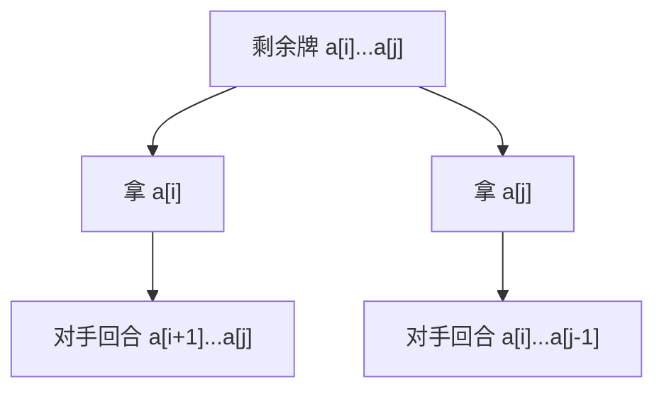

此为 rxb 的算法导论作业。

## 跳台阶 递归/DP

一只青蛙一次可以跳上1级台阶，也可以跳上3级台阶。
请问该青蛙跳上一个$n$级的台阶总共有多少种跳法？

请设计相应算法并给出详细思路和对应伪代码。

此外，请写出$n=8$时的详细计算过程。


<!-- tab 递归_1-->

详细思路：

1. 定义函数`frog_jump_recursive(n)`表示跳上n级台阶的跳法总数。
2. 基本情况：
   - 当n=0时，只有一种跳法，即不跳，返回1。
   - 当n=1时，只有一种跳法，即跳1级，返回1。
   - 当n=2时，只有一种跳法，即跳1级+1级，返回1。
3. 递归情况：
   - 对于n>=3的情况，青蛙可以从n-1级台阶跳1级上来，或者从n-3级台阶跳3级上来。因此，跳上n级台阶的跳法总数等于跳上n-1级台阶的跳法总数加上跳上n-3级台阶的跳法总数。
4. 最终返回`frog_jump_recursive(n)`的结果。

```Python
def frog_jump_recursive(n) -> int:
    if n == 0:
        return 1 # 0级台阶有1种跳法（不跳）
    elif n == 1:
        return 1 # 1级台阶有1种跳法（跳1级）
    elif n == 2:
        return 1 # 2级台阶有1种跳法（跳1级+1级）
    else:
        return frog_jump_recursive(n-1) + frog_jump_recursive(n-3) # 递归关系
```

在 $n=8$ 时的计算过程：

| $k$        | 0   | 1   | 2   | 3   | 4   | 5   | 6   | 7   | 8   |
| ---------- | --- | --- | --- | --- | --- | --- | --- | --- | --- |
| $f(k - 1)$ | /   | 1   | 1   | 1   | 2   | 3   | 4   | 6   | 9   |
| $f(k - 3)$ | /   | /   | /   | 1   | 1   | 1   | 2   | 3   | 4   |
| $f(k)$     | 1   | 1   | 1   | 2   | 3   | 4   | 6   | 9   | 13  |

<!-- endtab-->
<!-- tab DP_1-->
详细思路：

1. 定义一个数组`dp`，其中`dp[i]`表示跳上i级台阶的跳法总数。
2. 初始化基本情况：
   - `dp[0] = 1`：0级台阶有1种跳法（不跳）
   - `dp[1] = 1`：1级台阶有1种跳法（跳1级）
   - `dp[2] = 1`：2级台阶有1种跳法（跳1级+1级）
3. 使用循环从3到n计算每一级台阶的跳法总数：
   - 对于每个i，计算`dp[i] = dp[i-1] + dp[i-3]`，表示从i-1级跳1级和从i-3级跳3级的跳法总数之和。
4. 最终返回`dp[n]`的结果。

```Python
def frog_jump_dp(n) -> int:
    dp = [0] * (n + 1)
    dp[0] = 1  # 0级台阶有1种跳法（不跳）
    if n >= 1:
        dp[1] = 1  # 1级台阶有1种跳法（跳1级）
    if n >= 2:
        dp[2] = 1  # 2级台阶有1种跳法（跳1级+1级）
    
    for i in range(3, n + 1):
        dp[i] = dp[i - 1] + dp[i - 3] # 转移方程
    
    return dp[n]
```

在 $n=8$ 时的计算过程：

| $k$         | 0   | 1   | 2   | 3   | 4   | 5   | 6   | 7   | 8   |
| ----------- | --- | --- | --- | --- | --- | --- | --- | --- | --- |
| $dp[k - 1]$ | /   | 1   | 1   | 1   | 2   | 3   | 4   | 6   | 9   |
| $dp[k - 3]$ | /   | /   | /   | 1   | 1   | 1   | 2   | 3   | 4   |
| $dp[k]$     | 1   | 1   | 1   | 2   | 3   | 4   | 6   | 9   | 13  |

<!-- endtab-->


## 节点组合得分 DP

给定一个正整数数组$a$，其中$a[i]$表示第$i$个节点的得分，两个节点$i$和$j$之间的距离为$j-i$。一对节点$(i < j)$的组合得分为 $a[i]+a[j]+i-j$，即节点得分之和减去二者之间的距离。
请问最高得分组合的得分为多少？
请设计相应算法并给出详细思路和对应伪代码。
此外，请写出$a=[4, 5, 6, 2, 5, 3, 1, 9]$的详细计算过程。

---

详细思路：

1. 把共识拆解为两部分：节点得分之和 $a[i]+i$ 和 $a[j]-j$。
2. 对于确定的$j$，我们只需要找到一个$i < j$使得 $a[i]+i$ 的值最大。
3. 因此，我们可以使用一个变量`max_ai_plus_i`来记录当前为止的最大值 $a[i]+i$。
4. 遍历数组，对于每个$j$，计算当前组合得分为 `max_ai_plus_i + a[j] - j`，并更新最大得分。
5. 同时更新`max_ai_plus_i`为当前的 $a[j]+j$，以备后续的$j$使用。

```Python
def MaxCombinationScore(a) -> int:
    max_prev = a[0] + 0    // 初始化第一个节点的 a[i] + i
    max_score = -infinity  // 记录全局最高得分
    
    for j in range(1, len(a)):
        // 1. 计算以当前 j 结尾的最佳组合得分
        current_score = max_prev + a[j] - j
        
        // 2. 更新全局最大值
        max_score = max(max_score, current_score)
        
        // 3. 更新 max_prev，为下一个 j 做准备
        max_prev = max(max_prev, a[j] + j)
        
    return max_score
```

---

## 扑克游戏 DP/回溯

Kal'tsit（先手）和 Nahida（后手）（正好俩人都是绿的，还都聪明，简直巧妙）正在进行扑克游戏。
对于一列扑克牌 $a_1, a_2, \dots, a_n$，每张牌面表示其分值（范围1~13），
两人交替从头部或尾部拿牌，且每次都必须拿一张牌，当所有牌被拿完时，游戏结束，玩家手中所有牌的分值之和即为该玩家的总得分。
给定一列扑克牌$a_1, a_2, \dots, a_n$，假设（貌似无需假设）两人都非常聪明，求Kal'tsit能获得的最大得分以及她是否能够获得胜利。
请设计相应算法并给出详细思路和对应伪代码。

此外，请写出扑克牌为$\{7, 3, 10, 13, 6, 9, 2\}$时的详细计算过程。


<!-- tab DP_3-->
详细思路：

1. 定义一个二维数组`dp`，其中`dp[i][j]`表示在剩余牌为$a[i]$到$a[j]$时，当前玩家能获得的最大得分。
2. 初始化基本情况：
   - 当$i == j$时，只有一张牌可选，`dp[i][j] = a[i]`。
3. 使用双重循环计算`dp[i][j]`：
   - 对于每个区间长度`length`从2到n：
     - 对于每个起始索引`i`，计算结束索引`j = i + length - 1`：
       - 当前玩家可以选择拿`a[i]`或`a[j]`，然后对手会选择使当前玩家得分最小的策略。因此：
         - 如果拿`a[i]`，当前玩家得分为`a[i] + (sum(a[i+1]...a[j]) - dp[i+1][j])`
         - 如果拿`a[j]`，当前玩家得分为`a[j] + (sum(a[i]...a[j-1]) - dp[i][j-1])`
       - 取两者的最大值作为`dp[i][j]`。
4. 最终返回`dp[0][n-1]`的结果

```Python
def poker_game_dp(a) -> int:
    n = len(a)
    dp = [[0] * n for _ in range(n)]
    prefix_sum = [0] * (n + 1)

    for i in range(n):
        prefix_sum[i + 1] = prefix_sum[i] + a[i]

    for length in range(1, n + 1):
        for i in range(n - length + 1):
            j = i + length - 1
            if i == j:
                dp[i][j] = a[i]
            else:
                take_i = a[i] + (prefix_sum[j + 1] - prefix_sum[i + 1] - dp[i + 1][j])
                take_j = a[j] + (prefix_sum[j] - prefix_sum[i] - dp[i][j - 1])
                dp[i][j] = max(take_i, take_j)

    return dp[0][n - 1]
```

在 $a=\{7, 3, 10, 13, 6, 9, 2\}$ 时的计算过程：

kal:

|     | 7   | 3   | 10  | 13  | 6   | 9   | 2   |
| --- | --- | --- | --- | --- | --- | --- | --- |
| 7   | 7   | 7   | 13  | 20  | 23  | 25  | 25  |
| 3   |     | 3   | 10  | 16  | 16  | 25  | 25  |
| 10  |     |     | 10  | 13  | 16  | 22  | 18  |
| 13  |     |     |     | 13  | 13  | 19  | 22  |
| 6   |     |     |     |     | 6   | 9   | 8   |
| 9   |     |     |     |     |     | 9   | 9   |
| 2   |     |     |     |     |     |     | 2   |

na:

|     | 7   | 3   | 10  | 13  | 6   | 9   | 2   |
| --- | --- | --- | --- | --- | --- | --- | --- |
| 7   | 0   | 3   | 7   | 13  | 16  | 23  | 25  |
| 3   | 0   | 3   | 10  | 16  | 16  | 18  |     |
| 10  | 0   | 10  | 13  | 16  | 22  |     |     |
| 13  | 0   | 6   | 9   | 8   |     |     |     |
| 6   | 0   | 6   | 9   |     |     |     |     |
| 9   | 0   | 2   |     |     |     |     |     |
| 2   | 0   |     |     |     |     |     |     |

<!-- endtab-->
<!-- tab 回溯_3-->
详细思路：

1. 首先根结点表示当前剩余的牌为$a[i]$到$a[j]$，以及当前玩家的得分。
2. 使用深度优先搜索（DFS）遍历所有可能的选择路径：
   - 当前玩家可以选择拿`a[i]`或`a[j]`，然后递归调用函数表示对手的回合。
   - 对手会选择使当前玩家得分最小的策略，因此在递归调用中，计算当前玩家的得分时，需要减去对手能获得的最大得分。
3. 终止条件为当$i > j$时，表示没有牌可选，返回0。
4. 最终返回根结点的得分。

树形图：


<!-- endtab-->


## 保龄球游戏 DP

有一排保龄球，每个保龄球$a_i$有各自对应的分值$w_i$，其中$w_i$为有穷实数，你可以选择以下操作并计分：

1）击中单个保龄球$a_i$，分值$+w_i$

2）击中两个相邻保龄球$a_i$和$a_{i+1}$，分值$+w_i \times w_{i+1}$

3）停止击球并计算总分。

求给定保龄球序列和对应分值下的最高得分。
请设计相应算法并给出详细思路和对应伪代码。
此外，请写出保龄球分值为$[2, -3, -5, -4, 0, 9, 1]$时的详细计算过程。

详细思路：

1. 定义一个数组`dp`，其中`dp[i]`表示击中前i个保龄球所能获得的最高得分。
2. 初始化`dp[0] = 0`，表示没有保龄球时得分为0。
3. 使用循环从1到n计算每个保龄球的最高得分：
   - 对于每个保龄球$i$，考虑以下三种情况：
     - 击中单个保龄球$a[i-1]$，得分为`dp[i-1] + w[i-1]`
     - 击中两个相邻保龄球$a[i-2]$和$a[i-1]$，得分为`dp[i-2] + w[i-2] * w[i-1]`（前提是$i >= 2`）
     - 停止击球，得分为`dp[i-1]`（不击中当前保龄球）
   - 取三者的最大值作为`dp[i]`。
4. 最终返回`dp[n]`的结果。

```Python
def bowling_game_dp(w) -> float:
    n = len(w)
    dp = [0] * (n + 1)
    dp[0] = 0  # 没有保龄球时得分为0

    for i in range(1, n + 1):
        hit_single = dp[i - 1] + w[i - 1]  # 击中单个保龄球
        hit_double = dp[i - 2] + w[i - 2] * w[i - 1] if i >= 2 else float('-inf')  # 击中两个相邻保龄球
        stop = dp[i - 1]  # 停止击球
        dp[i] = max(hit_single, hit_double, stop)  # 取最大值

    return dp[n]
```

在 $w=[2, -3, -5, -4, 0, 9, 1]$ 时的计算过程：

| $k$                             | 0   | 1   | 2   | 3   | 4   | 5   | 6   | 7   |
| ------------------------------- | --- | --- | --- | --- | --- | --- | --- | --- |
| $L[k - 1]$                      | /   | 0   | 2   | 2   | 17  | 22  | 22  | 31  |
| $L[k - 1] + w_k$                | /   | 2   | -1  | -3  | 13  | 22  | 31  | 32  |
| $L[k - 2] + w_{k-1} \times w_k$ | /   | /   | -6  | 17  | 22  | 17  | 22  | 31  |
| $L[k]$                          | 0   | 2   | 2   | 17  | 22  | 22  | 31  | 32  |

## 硬币游戏 DP/回溯

钟离（先手）和 老鲤（后手）（正好俩人都是暗金色，还都和钱相关，简直巧妙）正在进行硬币游戏。
对于一堆硬币，每次可以从中拿取 $a \in A[]$枚硬币，其中$A[] = [a_1, a_2, \dots, a_m]$（$m \geq 1$）均为整数，并且恒有$a_1=1$。
游戏开始后，两人交替从该硬币堆中拿取硬币，且每次都必须拿，当所有硬币被拿完时，游戏结束，拿取最后一枚硬币（最后一次未必只拿1枚）的玩家获胜。

给定$n$个硬币，求问钟离是否能够获得胜利。
请设计相应算法并给出详细思路和对应伪代码。
此外，请写出$n=17$，$A=\{1,2,6\}$时的详细计算过程。

详细思路：

1. 定义一个布尔数组`dp`，其中`dp[i]`表示当剩余i枚硬币时，当前玩家是否能获胜。
2. 初始化`dp[0] = False`，表示没有硬币时当前玩家无法获胜。
3. 使用循环从1到n计算每个状态下当前玩家是否能获胜：
   - 对于每个状态i，遍历所有可拿取的硬币数a in A：
     - 如果`i - a >= 0`且`dp[i - a] == False`，则表示当前玩家可以通过拿a枚硬币使对手处于无法获胜的状态，因此`dp[i] = True`，并跳出循环。
4. 最终返回`dp[n]`的结果。

```Python
def coin_game_dp(n, A) -> bool:
    dp = [False] * (n + 1)  # 初始化dp数组
    dp[0] = False  # 没有硬币时当前玩家无法获胜

    for i in range(1, n + 1):
        for a in A:
            if i - a >= 0 and not dp[i - a]:  # 如果拿a枚硬币后对手无法获胜
                dp[i] = True  # 当前玩家能获胜
                break

    return dp[n]
```

在 $n=17$，$A=\{1,2,6\}$ 时的计算过程：

| $k$        | 0   | 1   | 2   | 3   | 4   | 5   | 6   | 7   | 8   | 9   | 10  | 11  | 12  | 13  | 14  | 15  | 16  | 17  |
| ---------- | --- | --- | --- | --- | --- | --- | --- | --- | --- | --- | --- | --- | --- | --- | --- | --- | --- | --- |
| $L(k - 1)$ | /   | F   | T   | T   | F   | T   | T   | T   | F   | T   | T   | F   | T   | T   | T   | F   |     | T   |
| $L(k - 2)$ | /   | /   | F   | T   | T   | F   | T   | T   | T   | F   | T   | T   | F   | T   | T   | T   | F   | T   |
| $L(k - 6)$ | /   | /   | /   | /   | /   | /   | F   | T   | T   | F   | T   | T   | F   | F   | T   | T   | F   | T   |
| $L(k)$     | F   | T   | T   | F   | T   | T   | T   | F   | T   | T   | F   | T   | T   | T   | F   | T   | T   | F   |
