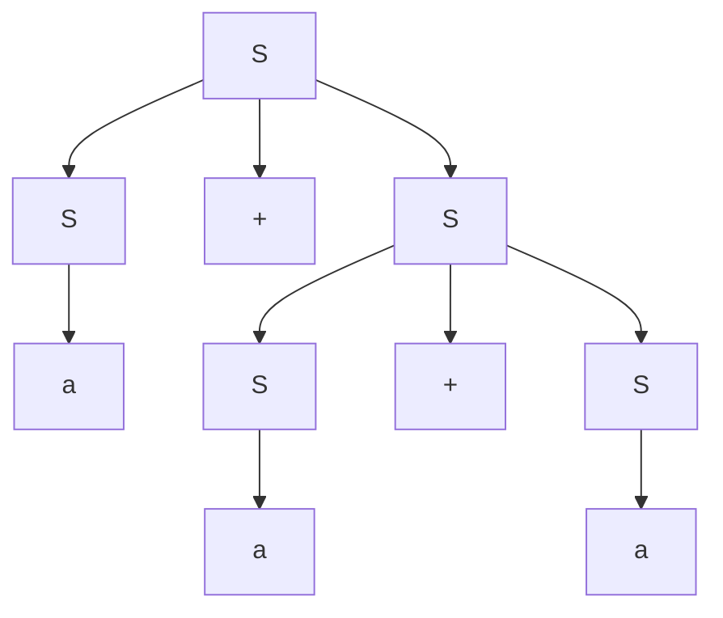
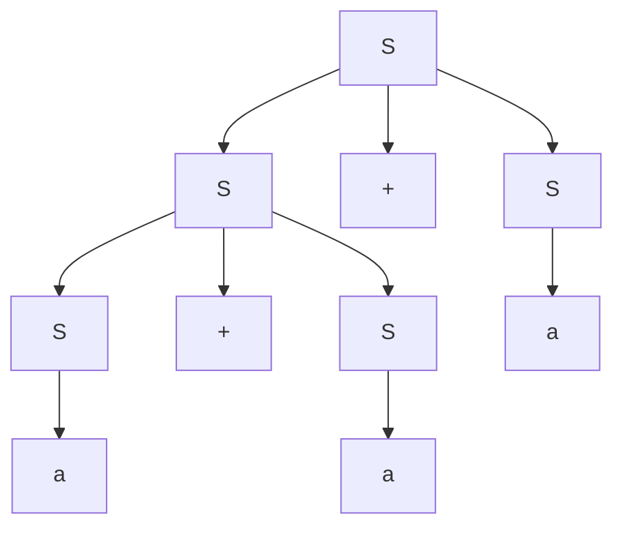

> 编译技术 2024 秋季学期的回忆版真题，来源于[计算机速通之家 | QQ 群号：468081841](https://qm.qq.com/q/ojSHMvHG5a)。
>
> 🙇‍♂️🙇‍♂️🙇‍♂️时间仓促，有不足之处烦请及时告知。[邮箱hez2z@foxmail.com](mailto:hez2z@foxmail.com) 或者在 [速通之家](https://qm.qq.com/q/ojSHMvHG5a) 群里 `@9¾`。

## DFA/NFA/文法/语法树

### 最简 DFA

$((\varepsilon|a)b^{\ast})^{\ast}$ DFA 化为最简

#### **步骤 1：化简正则式**

原式：

$$
R = ((\varepsilon|a)b^{\ast})^{\ast}
$$

先看里面的括号：

1. $(\varepsilon|a)$ 表示可以是空串 $\varepsilon$ 或者一个字母 $a$。
2. 所以 $((\varepsilon|a)b^{\ast})$ 可以展开为两种情况：

* $(\varepsilon b^{\ast}= b^{\ast})$
* $(a b^{\ast})$

因此：

$$
(\varepsilon|a)b^{\ast} = b^{\ast} \mid a b^{\ast}
$$

于是整个正则式化为：

$$
((\varepsilon|a)b^{\ast})^{\ast} = (b^{\ast} \mid a b^{\ast})^{\ast}
$$

#### **步骤 2：进一步化简**

注意：

1. 内部子式可以写成并集：$(\varepsilon|a)b^{\ast}= b^{\ast} \cup a b^{\ast}$。其中 $b^{\ast}$ 匹配任意个 b（包含空串），$a b^{\ast}$ 匹配以 a 开头并跟任意个 b 的串。
2. 外层的 Kleene 星对这两类块任意重复，因此能够拼出任意由 a 和 b 组成的串（包括空串）。因此可以直接断言：

$$
L(R) = (b^{\ast} \cup a b^{\ast})^{\ast} = \{a,b\}^{\ast}
$$
即原正则式能够生成所有由 a 和 b 组成的字符串。

#### **步骤 3：构造最简 DFA**

对于语言 ({a,b}^*)（所有由 a 和 b 组成的字符串），DFA 很简单：

* 只需要一个状态 ($q_0$)。
* ($q_0$) 同时是初态和终态。
* 对 a 或 b 的输入仍然回到 ($q_0$)。

**形式化表示**：

* 状态集：$(Q = \{q_0\})$
* 字母表：$(\Sigma = \{a,b\})$
* 初态：$q_0$
* 终态：$(F = \{q_0\})$
* 转移函数：

$$
\delta(q_0, a) = q_0, \quad \delta(q_0, b) = q_0
$$

#### **步骤 4：验证**

1. 空串 $\varepsilon$ 可接受，状态在 $q_0$。
2. 任意 b 序列，如 bbb，状态始终在 (q_0)，接受。
3. 任意 a 或 a 和 b 混合序列，如 "abba"，状态始终在 (q_0)，接受。
4. DFA 只有一个状态，无法再简化。

✅ DFA 最简。

**结论**：

原正则式

$$
((\varepsilon|a)b^{\ast})^{\ast}
$$

对应的最简 DFA 只有一个状态 $q_0$，初态也是终态，所有 a、b 的输入都回到 $q_0$。

### 判断二义性

Q: 判断文法 $S \to S*S \mid S+S \mid (S) \mid a$ 是否有二义性

> 判断二义性举反例就行了，即一个句子有两棵不同的语法树。答案不唯一。

A: 句子 $a + a + a$ 的两棵语法树如下：





### 语法分析树

画出语句的语法分析树，写出短语，直接短语，句柄

这里分析$(a + a) + a$的短语，直接短语，句柄

短语:

$$
\{a, a, a, a + a, (a + a), (a + a) + a\}
$$

直接短语:

$$
\{a, a , a\}
$$

句柄:

$$
a
$$

## $LL(1)$ 伪代码

写出文法对应的递归下降分析程序伪代码
$$S \to aAS \mid (A)$$
$$A \to Ab \mid c$$

A:

> 1. 判断文法是否是$LL(1)$?  
>
>     左递归、左公因子  
>     若不是，改造文法。  
>
> 2. 构造相关的**First**集合与**FOLLOW**集合  
> 3. 构造 $LL(1)$ 分析表  
> 4. 利用分析表给出句子的分析过程  
> 5. 写出文法的递归下降分析器

首先判断该文法是否是 $LL(1)$ 文法：

1. **消除左递归**

    $A \to Ab \mid c$ 存在左递归，改造为：
    $$A \to cA'$$
    $$A' \to bA' \mid \varepsilon$$

2. **消除左公因子**：文法中没有左公因子。

因此，该文法变成：

$$S \to aAS \mid (A)$$
$$A \to cA'$$
$$A' \to bA' \mid \varepsilon$$

接下来，构造各非终结符的 $FIRST$ 和 $FOLLOW$ 集合：

| 非终结符 | FIRST 集合 | FOLLOW 集合 |
| -------- | ---------- | ----------- |
| **S**    | { a, ( }   | { $ }       |
| **A**    | { c }      | { a, (, ) } |
| **A'**   | { b, ε }   | { a, (, ) } |

注意：在产生式 $S \to a A S$ 中，符号 $A$ 后面跟随的是非终结符 $S$，因此 $FOLLOW(A)$ 包含 $FIRST(S) \setminus \{\varepsilon\} = \{a,(\}$。另外在 $S\to(A)$ 中，右括号 $')'$ 也是 $FOLLOW(A)$ 的一部分。

然后，构造 $LL(1)$ 分析表（仅列出非空项）：

|        | a         | (         | c        | b         | )      | $   |
| ------ | --------- | --------- | -------- | --------- | ------ | --- |
| **S**  | S → a A S | S → ( A ) |          |           |        |     |
| **A**  |           |           | A → c A' |           |        |     |
| **A'** | A' → ε    | A' → ε    |          | A' → b A' | A' → ε |     |

这个题没有给出具体输入串，所以跳过逐步分析过程。

下面是该文法的递归下降分析器伪代码：


<!-- tab Advance-->
```C
void S() {
    if (lookahead == 'a') {
        advance(); // match('a')
        A();
        S();
    } else if (lookahead == '(') {
        advance(); // match('(')
        A();
        advance(); // match(')')
    } else {
        error("Expect 'a' or '('");
    }
}

void A() {
    if (lookahead == 'c') {
        advance(); // match('c')
        A_prime(); // 调用 A'
    } else {
        error("Expect 'c'");
    }
}

void A_prime() {
    if (lookahead == 'b') {
        advance(); // match('b')
        A_prime(); // 递归处理后续的 b
    } else if (lookahead == 'a' || lookahead == '(' || lookahead == ')') {
        // 属于 A' 的 FOLLOW 集合，匹配 epsilon，直接返回
        return;
    } else {
        error("Unexpected token in A'");
    }
}
```
<!-- endtab-->

<!-- tab match-->
```C
void S() {
    if (lookahead == 'a') {
        match('a');
        A();
        S();
    } else if (lookahead == '(') {
        match('(');
        A();
        match(')');
    } else {
        error("Expect 'a' or '('");
    }
}

void A() {
    if (lookahead == 'c') {
        match('c');
        A_prime(); // 调用 A'
    } else {
        error("Expect 'c'");
    }
}

void A_prime() {
    if (lookahead == 'b') {
        match('b');
        A_prime(); // 递归处理后续的 b
    } else if (lookahead == 'a' || lookahead == '(' || lookahead == ')') {
        // 属于 A' 的 FOLLOW 集合，匹配 epsilon，直接返回
        return;
    } else {
        error("Unexpected token in A'");
    }
}
```
<!-- endtab-->


伪代码的形式好像有 `advance()` 和 `match()` 两种。都是对的应该。

## $LL(1)$ 分析

$$<语句> \to <类型> <变量表>;$$
$$<类型> \to int \mid float \mid char$$
$$<变量表> \to ID,<变量表> \mid ID$$
注：$ID$ 为终结符

1. 改造为 $LL(1)$ 文法
2. 写出各非终结符的 $FIRST$、$FOLLOW$ 集
3. 画出 $LL(1)$ 分析表
4. 写出语句 $char\ x, y, z;$ 分析过程

A:

设 $<语句>$ 为 $S$，$<类型>$ 为 $T$，$<变量表>$ 为 $V$

则文法为：

$S \to TV;$

$T \to int \mid float \mid char$

$V \to ID,V \mid ID$

首先判断该文法是否是 $LL(1)$ 文法：

$V \to ID,V \mid ID$ 存在左公因子，改造为：

$V \to ID V'$

$V' \to , V \mid \varepsilon$

因此，改造后的文法为：

$S \to TV;$

$T \to int \mid float \mid char$

$V \to ID V'$

$V' \to , V \mid \varepsilon$

接下来，构造各非终结符的 $FIRST$ 和 $FOLLOW$ 集合：

| 非终结符 | FIRST 集合           | FOLLOW 集合 |
| -------- | -------------------- | ----------- |
| **S**    | { int, float, char } | { $ }       |
| **T**    | { int, float, char } | { ID }      |
| **V**    | { ID }               | { ; }       |
| **V'**   | { ',', ε }           | { ; }       |

然后，构造 $LL(1)$ 分析表：

|        | int     | float     | char     | ID  | ,         | ;      | $   |
| ------ | ------- | --------- | -------- | --- | --------- | ------ | --- |
| **S**  | S → TV; | S → TV;   | S → TV;  |     |           |        |     |
| **T**  | T → int | T → float | T → char |     |           |        |     |
| **V**  |         |           |          |     | V → ID V' |        |     |
| **V'** |         |           |          |     | V' → , V  | V' → ε |     |

最后分析一下语句 `char x, y, z;` 的分析过程：

| 步骤 | 栈         | 输入                  | 动作         |
| ---- | ---------- | --------------------- | ------------ |
| 1    | # S        | char ID , ID , ID ; # | S → T V ;    |
| 2    | # ; V T    | char ID , ID , ID ; # | T → char     |
| 3    | # ; V char | char ID , ID , ID ; # | 匹配 char    |
| 4    | # ; V      | ID , ID , ID ; #      | V → ID V'    |
| 5    | # V' ID ;  | ID , ID , ID ; #      | 匹配 ID（x） |
| 6    | # V' ;     | , ID , ID ; #         | V' → , V     |
| 7    | # V , ;    | , ID , ID ; #         | 匹配 ,       |
| 8    | # V ;      | ID , ID ; #           | V → ID V'    |
| 9    | # V' ID ;  | ID , ID ; #           | 匹配 ID      |
| 10   | # V' ;     | , ID ; #              | V' → , V     |
| 11   | # V , ;    | , ID ; #              | 匹配 ,       |
| 12   | # V ;      | ID ; #                | V → ID V'    |
| 13   | # V' ID ;  | ID ; #                | 匹配 ID      |
| 14   | # V' ;     | ; #                   | V' → ε       |
| 15   | # ;        | ; #                   | 匹配 ;       |
| 16   | #          | #                     | 接受         |

分析成功！

## 判断文法，构造分析表，分析输入串

已知文法为: $A \to aAd \mid a \mid b \mid \varepsilon$

1. 判断该文法是否是 $LR(0)$ 文法，是否是 $SLR(1)$ 文法  
2. 若是 $SLR(1)$ 文法，构造相应分析表
3. 对输入串 $ab$# 给出分析过程

A:

> 1. 构造文法的 $LR(0)$ 项目集规范族  
> 2. 构造识别活前缀的DFA  
> 3. 这个文法哪类 $LR$ 文法并说明理由

[【编译原理速成之LR(0)和SLR(1)】](https://www.bilibili.com/video/BV14WrVYFE9T/?share_source=copy_web&vd_source=ece2a9c84bf4c011ecb77b7f31228f25)

> 太多了，压榨 AI 也没法写了，直接看视频吧。

## 四元式

写出程序的四元式序列

```c
while(a > 0 && b > 0) {
    if(x > y) {
        // 两个赋值语句
    }
    else
}
```

### 详细解析

由于题目中两个赋值语句的具体内容没有给出，我们假设为典型的赋值语句：`a = b + c` 和 `x = y * z`。实际题目中可能有具体赋值语句。

#### 四元式生成过程

1. **while循环的条件处理**：
   * `a > 0 && b > 0` 需要分解为两个条件
   * 先计算 `a > 0`，再计算 `b > 0`，最后做逻辑与

2. **控制流标签**：
   * `L1`: while循环开始标签
   * `L2`: 循环体开始标签
   * `L3`: if条件为真时跳转标签
   * `L4`: if语句结束标签
   * `L5`: while循环结束标签

#### 四元式序列

| 序号 | 四元式             | 注释                     |
| ---- | ------------------ | ------------------------ |
| 1    | (j, , , L1)        | 跳转到循环开始           |
| 2    | (>, a, 0, t1)      | t1 = a > 0               |
| 3    | (jfalse, t1, , L5) | 如果 t1 为假，跳出循环   |
| 4    | (>, b, 0, t2)      | t2 = b > 0               |
| 5    | (jfalse, t2, , L5) | 如果 t2 为假，跳出循环   |
| 6    | (>, x, y, t3)      | t3 = x > y               |
| 7    | (jfalse, t3, , L4) | 如果 t3 为假，跳转到else |
| 8    | (+, b, c, t4)      | t4 = b + c (第一个赋值)  |
| 9    | (=, t4, , a)       | a = t4                   |
| 10   | (*, y, z, t5)      | t5 = y * z (第二个赋值)  |
| 11   | (=, t5, , x)       | x = t5                   |
| 12   | (j, , , L1)        | 跳转回循环开始           |
| 13   | (label, , , L4)    | else分支开始标签         |
| 14   | (j, , , L1)        | else为空，直接跳回循环   |
| 15   | (label, , , L5)    | 循环结束标签             |

#### 说明

* **条件短路**：`&&` 操作符具有短路特性，如果第一个条件 `a > 0` 为假，直接跳出循环

* **逻辑与**：通过两个连续的条件判断实现 `&&`

* **控制流**：使用 `jfalse` 和 `j` 四元式实现条件跳转和无条件跳转

* **临时变量**：使用 `t1, t2, t3, t4, t5` 存储中间结果

* **标签**：使用标签实现循环和分支的跳转目标

## 设计文法

1. $\{a^i b^j | i \geq 0, j \geq 0, i+j \geq 2\}$

2. $\{(a,b)^* | a的数量比b的数量多1\}$

### 文法一

设有文法：

$S \to AA \mid BB \mid AB$

$A \to aA \mid a \mid \varepsilon$

$B \to bB \mid b \mid \varepsilon$

### 文法二

$S \to EaE$

$E \to EE \mid aEb \mid bEa \mid \varepsilon$

## 求语法指导翻译方案和语法定义

题目有给例子 $abaabaaba$

$S \to aAbA$

$A \to aSb$

$A \to bSa$

$A \to a$

1. 输出每个 $b$ 的位置 样例输出 (2 5 8)

2. 输出 $a$ 的数量 样例输出 (6)

> 救命，这是什么
