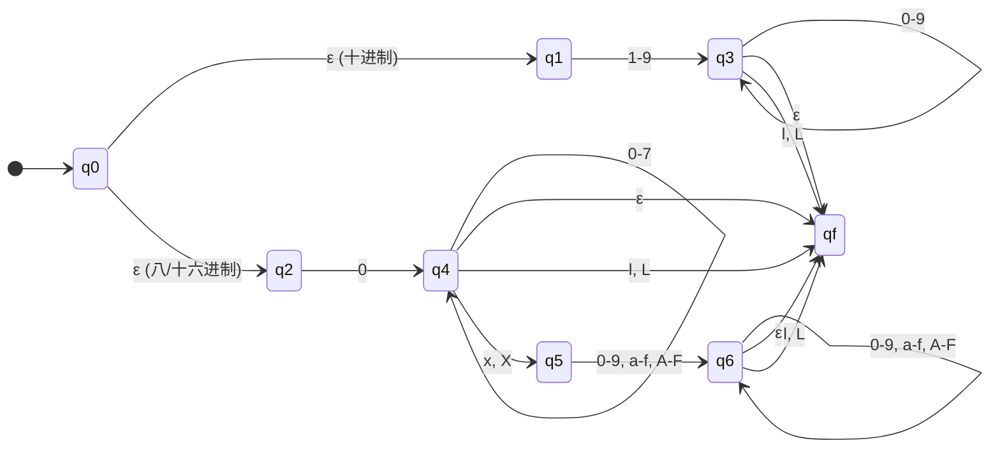
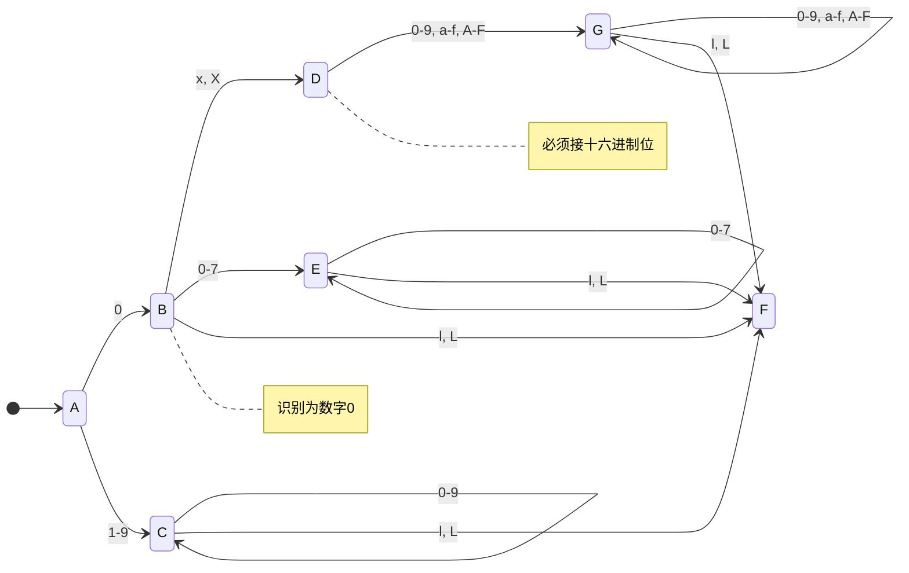
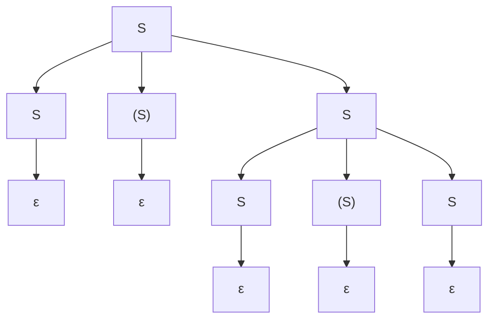
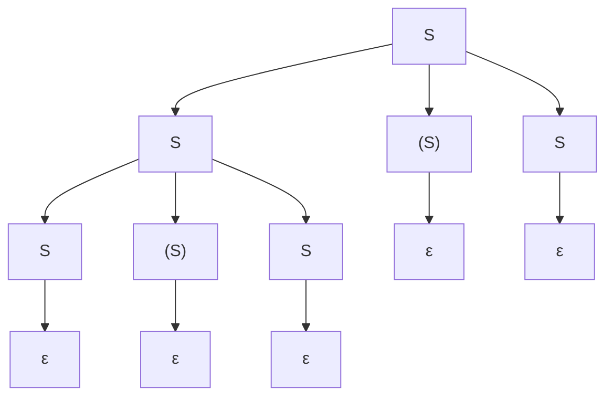
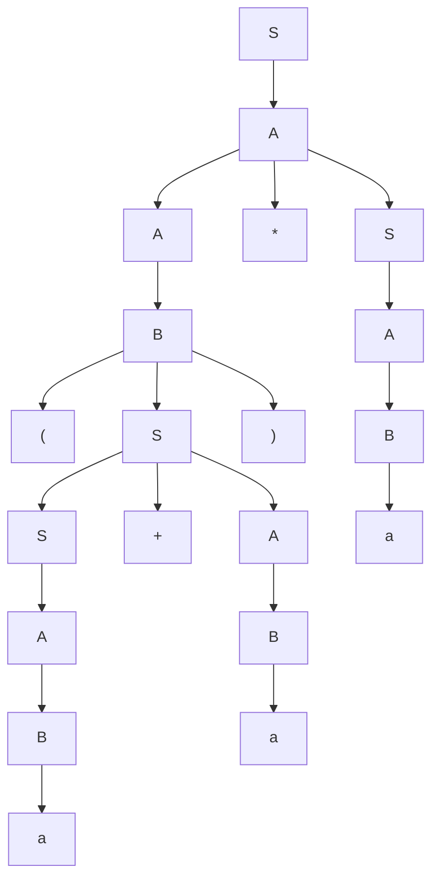

> 编译技术 2025 秋季学期的复习课内容，答案来自 ChatGPT 和 Gemini，由我进行整理和补充。
>
> 本文连载于[编译技术-2025fa-lb复习课| HeZzz](https://hez2z.github.io/2025/12/24/%E7%BC%96%E8%AF%91%E6%8A%80%E6%9C%AF-2025fa-lb%E5%A4%8D%E4%B9%A0%E8%AF%BE/)
>
> 🙇‍♂️🙇‍♂️🙇‍♂️时间仓促，有不足之处烦请及时告知。[邮箱hez2z@foxmail.com](mailto:hez2z@foxmail.com) 或者在 [速通之家](https://qm.qq.com/q/ojSHMvHG5a) 群里 `@9¾`。

## 有限自动机与正规式之间的相互转换

例：字母表$\{0,1,2,3\}$，对给定正则表达式  

$0^ * (1|23)(0|12)0(1|13)^ *$

构造与之等价的 $DFA$ $M$ 。  
包括：$NFA$ 的确定化、$DFA$ 的最小化。

> 看完前面的 正则 和 DFA 的转换就可以做这个题了。

[编译原理《第二章》正规式、正规文法、自动机DFA and NFA的转换#期末复习](https://www.bilibili.com/video/BV1bM4y1Q75x/?share_source=copy_web&vd_source=ece2a9c84bf4c011ecb77b7f31228f25)

---

## 利用正规式描述高级语言中的某个单词结构

构造相应的 $NFA$ 和与之等价的 $DFA$。并给出识别单词的程序的伪代码。

例：C++ 有各种整型常量，以下是整数值的名称。

十进制数的简单序列总为整型常量。

$0x$ 为前缀的十六进制数序列为整型常量。

以 $0$ 为前缀的八进制数序列为整型常量。

以 $L$ 或 $l$ 为后缀的整型常量表示的类型为 $long\ int$。

编写一个如上描述用于识别 C++ 中整型常量的正则表达式，并构造相应的 $NFA$ 和 $DFA$。

### 正规式描述

定义字符集：

* 数字：$D = [0\text{-}9]$
* 非零数字：$NZ = [1\text{-}9]$
* 八进制数字：$O = [0\text{-}7]$
* 十六进制数字：$H = [0\text{-}9a\text{-}fA\text{-}F]$
* 后缀：$S = [lL]$

则 C++(简化版)整型常量可由如下正规式描述：

$$
(0[xX]H^+ \mid 0O^* \mid NZD^*)S?
$$

其中：

* $0[xX]H^+$ 表示十六进制整型常量, $H^+$ 表示至少一个十六进制数字；
* $0O^*$ 表示八进制整型常量(包含单独的 $0$), $O^*$ 表示零个或多个八进制数字；
* $NZD^*$ 表示十进制整型常量(不允许前导零), $D^*$ 表示零个或多个十进制数字；
* $S?$ 表示可选的 $long\ int$ 后缀。

### NFA 构造(文字描述)

采用 [`Thompson` 构造法](https://en.wikipedia.org/wiki/Thompson%27s_construction)，从初态通过 $\varepsilon$-转换分为三条路径：

1. **十进制路径**：
   读入 $[1\text{-}9]$，随后循环读入 $[0\text{-}9]$，末尾可选择性读入 $l/L$ 后到达终态。

2. **八进制路径**：
   读入字符 $0$，随后循环读入 $[0\text{-}7]$，末尾可选择性读入 $l/L$ 后到达终态。

3. **十六进制路径**：
   在读入 $0$ 后继续读入 $x$ 或 $X$，随后至少读入一个 $[0\text{-}9a\text{-}fA\text{-}F]$，再循环读入该字符集，末尾可选择性读入 $l/L$ 后到达终态。

### 等价 DFA 构造(状态与转移)

DFA 状态含义

| 状态 | 含义                | 是否终态 |
| ---- | ------------------- | -------- |
| A    | 初始状态            | 否       |
| B    | 已读入 `0`          | 是       |
| C    | 十进制识别中        | 是       |
| D    | 已读入 `0x` 或 `0X` | 否       |
| E    | 八进制识别中        | 是       |
| F    | 已读入后缀 `L/l`    | 是       |
| G    | 十六进制识别中      | 是       |

> 在 DFA 中，终态并不意味着输入必须结束，而只表示：“到目前为止读入的字符串是语言中的一个成员。”。

主要状态转移规则

* A：
  `0 → B`，`1–9 → C`
* B：
  `0–7 → E`，`x/X → D`，`L/l → F`
* C：
  `0–9 → C`，`L/l → F`
* D：
  `0–9a–fA–F → G`
* E：
  `0–7 → E`，`L/l → F`
* G：
  `0–9a–fA–F → G`，`L/l → F`

未定义的输入一律转入拒绝状态。

### 整型常量识别的伪代码(DFA 实现)

```cpp
bool isCppIntegerConstant(string s) {
    char state = 'A';
    int i = 0;

    while (i < s.length()) {
        char c = s[i];

        switch (state) {
            case 'A':
                if (c == '0') state = 'B';
                else if (c >= '1' && c <= '9') state = 'C';
                else return false;
                break;

            case 'B':
                if (c >= '0' && c <= '7') state = 'E';
                else if (c == 'x' || c == 'X') state = 'D';
                else if (c == 'L' || c == 'l') state = 'F';
                else return false;
                break;

            case 'C':
                if (c >= '0' && c <= '9') state = 'C';
                else if (c == 'L' || c == 'l') state = 'F';
                else return false;
                break;

            case 'D':
                if (isHexDigit(c)) state = 'G';
                else return false;
                break;

            case 'E':
                if (c >= '0' && c <= '7') state = 'E';
                else if (c == 'L' || c == 'l') state = 'F';
                else return false;
                break;

            case 'G':
                if (isHexDigit(c)) state = 'G';
                else if (c == 'L' || c == 'l') state = 'F';
                else return false;
                break;

            case 'F':
                return false; // 后缀后不允许再有字符
        }
        i++;
    }

    return (state == 'B' || state == 'C'
         || state == 'E' || state == 'F'
         || state == 'G');
}
```

### NFA

> 状态图使用 Mermaid 语法绘制，不太美观，凑合看



### DFA



> 以下是 ChatGPT 画的图，看看有什么错误


NFA 和 DFA 的区别：

* NFA 可以有多个初态和多个终态，DFA 只有一个初态；
* NFA 可以有 $\varepsilon$-转换，DFA 不允许有 $\varepsilon$-转换；
* NFA 在某一状态下对同一输入符号可以有多个转移，而 DFA 对每一状态和输入符号只有一个确定的转移。
* NFA 的状态转换是非确定性的，而 DFA 的状态转换是确定性的。
* NFA 的实现通常更简单，但在实际应用中，DFA 更高效，因为它不需要回溯。

---

## 判断某一文法是否是二义性文法

(举一反例，一个句子有两个不同结构的语法分析树)

例：假设 $G[S]$ 为 $S \to S(S)S\ |\ \varepsilon$ ，证明文法 $G[S]$ 为二义性文法。

### 第一步：识别“二义性基因”(结构观察)

当你拿到一个文法，先看它的产生式长什么样。如果一个非终结符(比如 )在同一个产生式中**出现了两次或以上**，且它们之间没有明确的“优先级”保护，那么这个文法大概率有二义性。

对于 $S \to S(S)S\ |\ \varepsilon$ ，我们观察到：

1. **左右对称性**：外层有两个 $S$，左 $S$ 和右 $S$。
2. **递归性**：这些 $S$ 都可以推导出相同的结构。

**直觉告诉我们**：既然左边能长出东西，右边也能长出东西，那么对于两个并列的结构(如两个括号)，我是让“左边的 $S$ 长出一个，剩下的归右边”，还是“右边的 $S$ 长出一个，剩下的归左边”？这就是歧义的来源。

### 第二步：寻找“最小重复单元”(寻找反例)

要证明歧义，你得让这个文法**做选择**。

* **如果选 $w = ( )$**：这个句子太单薄了。为了凑出这个句子，你只能用掉一个 $(S)$ 的额度，剩下的 $S$ 必须全部变为空。你没有给文法“选择”的余地，所以它不是反例。
* **如果选 $w = ()()$**：这里有两个并列的括号。文法现在面临两个选择：
* **选择 1(偏左)**：用最外层的 $S$ 产生第一个 $()$ ，剩下的交给右边的 $S$ 去处理。
* **选择 2(偏右)**：用最外层的 $S$ 产生第二个 $()$ ，前面的交给左边的 $S$ 去处理。

**做题技巧**：寻找文法中**最核心的特征符号**(本题是括号)，然后将其**重复两次**构造出一个新句子。

---

### 第三步：验证“结构的实质差异”(画图对比)

当你脑海里有了 $()()$ 这个目标，你尝试画出两棵树。如果发现它们的**根基**不一样，那就成功了。

#### 树 A：以第一个 $()$ 为“主干”

让根节点的 $(S)$ 部分负责第一个括号，剩下的通过右边的 $S$ 产生。

这里，第一个括号在树的**第一层**。

#### 树 B：以第二个 $()$ 为“主干”

让根节点的 $(S)$ 部分负责第二个括号，前面的通过左边的 $S$ 产生。

这里，第二个括号在树的**第一层**。

**这两棵树的高矮、胖瘦、分支方向完全不同，这就是二义性。**

树 A



树 B



总结：通过构造句子 $()()$ 并画出两棵不同的语法分析树，我们证明了文法 $S \to S(S)S\ |\ \varepsilon$ 是二义性的。

Gemini 例：

文法 $G$ 的产生式为：  
$S \to SS | a$ ,证明该文法是二义性的。

文法 $G$ 的产生式为:
$E \to E + E |  id$

答案见 [证明文法二义性答案](#证明文法二义性答案)

---

## 给定文法，给定某一句型或句子

1. 最左推导、最右推导及相应的语法分析树  

2. 所有短语、直接短语和句柄

---

$abbcde$ 对它的逆过程最左归约(规范归约)为：  

$ab[2]b[3]cd[4]e[1]$

$\Leftarrow aAb[3]cd[4]e[1]$

$\Leftarrow aAcd[4]e[1]$

$\Leftarrow aAcBe[1]$

$\Leftarrow S$

为产生式加序号变为：  

$S \to aAcBe[1]$  

$A \to b[2]$  

$A \to Ab[3]$  

$B \to d[4]$

这几个就是句柄。

规范句型：  

$abbcde$，$aAbcde$，$aAcde$，$aAcBe$，$S$

Q:

1. 该规范句型的活前缀是什么？  
2. 上例规范句型是什么？

A:

有下面规范句型的活前缀：

* $\varepsilon$，$a$，$ab$
* $\varepsilon$，$a$，$aA$，$aAb$
* $\varepsilon$，$a$，$aA$，$aAc$，$aAcd$
* $\varepsilon$，$a$，$aA$，$aAc$，$aAcB$，$aAcBe$

$ab[2]b[3]cd[4]e[1]$

$\Leftarrow aAb[3]cd[4]e[1]$

$\Leftarrow aAcd[4]e[1]$

$\Leftarrow aAcBe[1]$

$\Leftarrow S$

规范句型：

$abbcde$，$aAbcde$，$aAcde$，$aAcBe$，$S$

用哪个产生式继续归约仅取决于当前句型的前部。

| 当前句型 | 句柄                  | 规范句型 | 活前缀                                           |
| -------- | --------------------- | -------- | ------------------------------------------------ |
| $abbcde$ | $b (A \to b)$         | $aAbcde$ | $\varepsilon$, $a$, $ab$                         |
| $aAbcde$ | $Ab (A \to Ab)$       | $aAcde$  | $\varepsilon$, $a$, $aA$, $aAb$                  |
| $aAcde$  | $d (B \to d)$         | $aAcBe$  | $\varepsilon$, $a$, $aA$, $aAc$, $aAcd$          |
| $aAcBe$  | $aAcBe (S \to aAcBe)$ | $S$      | $\varepsilon$, $a$, $aA$, $aAc$, $aAcB$, $aAcBe$ |

> Gemini 的思考：

以下是我在做这道题时的思维全路径，你可以参考这个步骤来建立自己的解题模型：
第一阶段：观察与预判(扫描文法)

拿到题目，先不要直接开始做，先看产生式：

  $S→aAcBe$ (这是总结构：$a…c…e$)

  $A→b$ 和 $A→Ab$ (这说明 A 是一个左递归结构，用来生成一个或多个 b)

  $B→d$ (简单的单一替换)
预判： 看到 $abbcde$，我脑子里会立刻把其拆解为：$a+(bb)+c+(d)+e$。对应的就是 $a+A+c+B+e$。
第二阶段：逆向推导(寻找归约路径)

规范归约要求每次必须找句柄。如果你不确定谁是句柄，就尝试从最底层画一棵简单的树，或者按顺序尝试。

* 第一步： 看到 $abbcde$，第一个可以归约的符号是第一个 b。

    思考： $A \to b$ 存在。归约后变成 $aAbcde$。

* 第二步： 看到 $aAbcde$。此时有两个选择：是把第二个 $b$ 归约为 $A$，还是把 $Ab$ 归约为 $A$？

    决策： 根据文法 $A \to Ab$，为了形成规范归约，我们应该把 $Ab$ 整体归约。得到 $aAcde$。
* 第三步： 看到 $aAcde$。现在剩下 $d$。

    思考： $B \to d$ 存在。归约后变成 $aAcBe$。

  最后： 整体符合 $S \to aAcBe$，归约为 $S$。

第三阶段：精准定义(回答题目要求)

一旦有了上面的归约链条，回答具体问题就是“照方抓药”：

1. 如何确定规范句型？
  
   * 思考路径： 归约过程倒过来写，就是最右推导。推导中出现的每一行都是规范句型。

   * $S \to aAcBe \to aAcde \to aAbcde \to abbcde$

2. 如何找短语、直接短语、句柄？

   * 这是最容易丢分的地方。我的思考绝招是画语法树。

   * 短语： 每一棵子树的末端叶子节点连接起来就是一个短语。

     * 看 $A$ 的子树，叶子是第二个 $b$ 吗？不，是第一个 $b$ 和第二个 $b$ 组成的 $Ab$。

   * 直接短语： 只有两层的子树(即：非终结符直接推出终结符)。

     * 图中明显的只有 $A \to b$ (第一个 $b$) 和 $B \to d$。

   * 句柄： 直接短语中最左边的那个。

     * 第一个 $b$。

3. 如何确定活前缀？

思考路径： 记住一句话——“活前缀就是不包含句柄右侧符号的前缀”。

* 对于每一个规范句型，我先标出它的句柄。

* 然后从左往右写前缀，写到句柄的最后一个符号就停止。

* 例子： 句型 $aAcde$，句柄是 $d$。那么它的活前缀就是 $\varepsilon,a,aA,aAc,aAcd$(到 $d$ 截止，后面的 $e$ 绝对不能要)。

总结：你的“避坑”清单

* 不要跳步： 即使一眼看出 bb 变成 A，也要按照规范归约一步步来(先归第一个 b)。

* 分清左右： 规范归约是自左向右扫描，寻找句柄。

* 前缀 vs 活前缀： 普通前缀可以包含任何符号，但活前缀一定不能越过当前句柄的右边界。

---

Q:

文法 $G[S]$ 的产生式为：  
$S \to S + A\ |\ A$  
$A \to A * S\ |\ B$  
$B \to a\ |\ (S)$  

1. 给出 $(a+a)*a$ 的最左推导、最右推导及相应的分析树；  
2. 列出句型 $B+A*B$ 的所有短语、直接短语和句柄。

A:

终结符：`a`, `+`, `*`, `(`, `)`  
非终结符：`S`, `A`, `B`

### **1. 最左推导**

最左推导是每次总是替换最左的非终结符：

$S \Rightarrow A$

$\Rightarrow A * S$

$\Rightarrow B * S$

$\Rightarrow (S) * S$

$\Rightarrow (S + A) * S$

$\Rightarrow (A + A) * S$

$\Rightarrow (B + A) * S$

$\Rightarrow (a + A) * S$

$\Rightarrow (a + B) * S$

$\Rightarrow (a + a) * S$

$\Rightarrow (a + a) * A$

$\Rightarrow (a + a) * B$

$\Rightarrow (a + a) * a$

---

### **2. 最右推导**

最右推导是每次总是替换最右的非终结符：

$S \Rightarrow A$

$\Rightarrow A * S$

$\Rightarrow A * A$

$\Rightarrow B * A$

$\Rightarrow B * B$

$\Rightarrow B * a$

$\Rightarrow (S) * a$

$\Rightarrow (S + A) * a$

$\Rightarrow (A + A) * a$

$\Rightarrow (B + A) * a$

$\Rightarrow (a + A) * a$

$\Rightarrow (a + B) * a$

$\Rightarrow (a + a) * a$

---

### **3. 分析树(Mermaid 绘图)**



> 注：
>
> * 根节点 `S` 对应整个句子
> * 树的结构反映最左推导顺序
> * 每个非终结符展开，直到终结符 `a` 或符号 `+`、`*`、`(`、`)`

---

### **句型 $B+A*B$ 的短语、直接短语和句柄**

为了找出短语，我们先看该句型是如何从开始符号 $S$ 推导出来的：

$S$

$\Rightarrow S+A$

$\Rightarrow A+A$

$\Rightarrow B+A$

$\Rightarrow B+A * S$

$\Rightarrow B+A * A$

$\Rightarrow B+A * B$

对应推导树的子树叶子节点，我们可以得出：

| 类别     | 内容            | 说明                                 |
| -------- | --------------- | ------------------------------------ |
| 所有短语 | $B, A∗B, B+A∗B$ | 每一棵子树的叶子节点序列             |
| 直接短语 | $B, A∗B$        | 只有两层结构的子树（产生式直接推出） |
| 句柄     | $B$             | 最左边的直接短语                     |

解析补充：

* 短语：该句型推导树中所有子树的叶子节点序列。

* 直接短语：产生式一步推导出的部分（即高度为 2 的子树）。在本例中，$S \to B$ 不存在，但有 $A \to B$ 和 $A \to A * S$，所以 $B$ 和 $A * B$ 是直接短语。

* 句柄：句型中最左边的直接短语。

---

## 给定$LL(1)$文法

1. 判断文法是否是$LL(1)$?  

    左递归、左公因子  
    若不是，改造文法。  

2. 构造相关的**First**集合与**FOLLOW**集合  
3. 构造 $LL(1)$ 分析表  
4. 利用分析表给出句子的分析过程  
5. 写出文法的递归下降分析器

**例**：设文法 $G(S)$:  

$S \to S+aF\ |\ aF\ |\ +aF$

$F \to *aF\ |\ *a$  

1. 消除左递归和回溯；  
2. 构造非终结符的**FIRST**和**FOLLOW**集合；  
3. 构造预测分析表  
4. 给出句子 $a*a+a*a$ 的 $LL(1)$ 分析过程  
5. 写出递归下降分析器的伪代码

A:

> $LL(1)$ : 自顶向下分析法，使用一个符号栈和一个输入缓冲区，预测下一个要使用的产生式。

### 1. 消除左递归和回溯

原文法 $G(S)$ 为：

1. $S \to S+aF \mid aF \mid +aF$
2. $F \to *aF \mid *a$

#### (1) 消除左递归

对于 $S \to S+aF \mid aF \mid +aF$，存在直接左递归。
设 $\alpha = +aF$，$\beta_1 = aF, \beta_2 = +aF$。引入新非终结符 $S'$：
$$S \to aFS' \mid +aFS'$$
$$S' \to +aFS' \mid \epsilon$$

#### (2) 提取左公因子（消除回溯）

对于 $F \to *aF \mid *a$，存在公共左因子 $*a$。
引入新非终结符 $F'$：
$$F \to *aF'$$
$$F' \to *aF' \mid \epsilon$$
*(注：此处将 $F \to *a$ 视为递归的终点，简化为 $F' \to *aF' \mid \epsilon$ 以符合标准 LL(1) 构造)*

### 2. 构造**FIRST**和**FOLLOW**集合

#### (1) FIRST 集合

* $FIRST(S)$:
  * 从 $S \to aFS'$ 得到 $a$
  * 从 $S \to +aFS'$ 得到 $+$
  
  因此，$FIRST(S) = \{ a, + \}$

* $FIRST(S')$:
  * 从 $S' \to +aFS'$ 得到 $+$
  * 从 $S' \to \epsilon$ 得到 $\epsilon$

  因此，$FIRST(S') = \{ +, \epsilon \}$

* $FIRST(F)$:

  * 从 $F \to *aF'$ 得到 $*$
  
  因此，$FIRST(F) = \{ * \}$

* $FIRST(F')$:
  * 从 $F' \to *aF'$ 得到 $*$
  * 从 $F' \to \epsilon$ 得到 $\epsilon$

  因此，$FIRST(F') = \{ *, \epsilon \}$

#### (2) FOLLOW 集合

* $FOLLOW(S)$:
  * 作为开始符号，包含 `#`
  * 从 $S \to S + aF$，`+` 在 $S$ 后面，加入 `+`
  
  因此，$FOLLOW(S) =$ { +, # }

* $FOLLOW(S')$:
  * 从 $S \to aFS'$，$FOLLOW(S)$ 加入 $FOLLOW(S')$
  * 从 $S' \to +aFS'$，$FOLLOW(S)$ 加入 $FOLLOW(S')$

  因此，$FOLLOW(S') =$ { +, # }

* $FOLLOW(F)$:
  * 从 $S \to aFS'$，$FOLLOW(S')$ 加入 $FOLLOW(F)$
  * 从 $S' \to +aFS'$，$FOLLOW(S')$ 加入 $FOLLOW(F)$

  因此，$FOLLOW(F) =$ { +, # }

* $FOLLOW(F')$:
  * 从 $F \to *aF'$，$FOLLOW(F)$ 加入 $FOLLOW(F')$
  * 从 $F' \to *aF'$，$FOLLOW(F)$ 加入 $FOLLOW(F')$

  因此，$FOLLOW(F') =$ { +, # }

### 3. 构造预测分析表

根据 $FIRST$ 和 $FOLLOW$ 集合填入产生式：

| $M$      | $a$          | $+$               | $*$           | `#`               |
| :------- | :----------- | :---------------- | :------------ | :---------------- |
| **$S$**  | $S \to aFS'$ | $S \to +aFS'$     |               |                   |
| **$S'$** |              | $S' \to +aFS'$    |               | $S' \to \epsilon$ |
| **$F$**  |              |                   | $F \to *aF'$  |                   |
| **$F'$** |              | $F' \to \epsilon$ | $F' \to *aF'$ | $F' \to \epsilon$ |

在这里，行的内容为非终结符，列的内容为终结符。表格中的每个单元格表示在当前非终结符和输入符号下应使用的产生式。

### 4. 句子 $a*a+a*a$ 的分析过程

| 步骤 | 符号栈      | 输入串       | 所用产生式         |
| :--- | :---------- | :----------- | :----------------- |
| 1    | `#`$S$      | $a*a+a*a$`#` | $S \to aFS'$       |
| 2    | `#`$S'Fa$   | $a*a+a*a$`#` | 匹配 $a$           |
| 3    | `#`$S'F$    | $*a+a*a$`#`  | $F \to *aF'$       |
| 4    | `#`$S'F'a*$ | $*a+a*a$`#`  | 匹配 $*$           |
| 5    | `#`$S'F'a$  | $a+a*a$`#`   | 匹配 $a$           |
| 6    | `#`$S'F'$   | $+a*a$`#`    | $F' \to \epsilon$  |
| 7    | `#`$S'$     | $+a*a$`#`    | $S' \to +aFS'$     |
| 8    | `#`$S'Fa+$  | $+a*a$`#`    | 匹配 $+$           |
| 9    | `#`$S'Fa$   | $a*a$`#`     | 匹配 $a$           |
| 10   | `#`$S'F$    | $*a$`#`      | $F \to *aF'$       |
| 11   | `#`$S'F'a*$ | $*a$`#`      | 匹配 $*$           |
| 12   | `#`$S'F'a$  | $a$`#`       | 匹配 $a$           |
| 13   | `#`$S'F'$   | `#`          | $F' \to \epsilon$  |
| 14   | `#`$S'$     | `#`          | $S' \to \epsilon$  |
| 15   | `#`         | `#`          | **接受 (Success)** |

在这里，

1. 逆序入栈原则： 当应用产生式 $A \to XYZ$ 时，栈的弹出顺序应该是 $X \to Y \to Z$。因此在物理栈结构中，压栈顺序必须是 $Z$ 先入，$Y$ 次之，$X$ 最后入（处于栈顶）。

2. 空产生式 (epsilon) 的触发条件： 在步骤 6 和步骤 13、14 中，当栈顶是非终结符且无法直接产生当前输入符时，程序会检查当前输入符是否在 $FOLLOW$ 集合中。

* 例如步骤 6：`+` 属于 $FOLLOW(F')$，故执行 $F' \to \epsilon$。

* 例如步骤 14：`#` 属于 $FOLLOW(S')$，故执行 $S' \to \epsilon$。

分析成功的标准： 栈顶只剩 `#` 且 输入串只剩 `#`。此时证明句子 $a*a+a*a$ 完全符合文法 $G(S)$ 的逻辑结构。

### 5. 递归下降分析器伪代码

```cpp
string lookahead; // 当前读入的符号

// 匹配当前符号，若匹配成功则读取下一个符号，否则报错
void match(string t) {
  if (lookahead == t) lookahead = getNextToken();
  else error("Syntax Error");
}

/*
* S -> aFS' | +aFS'
* 如果 lookahead 是 'a'，则选择产生式 S -> aFS'
* 如果 lookahead 是 '+'，则选择产生式 S -> +aFS'
*/
void S() {
  if (lookahead == "a") {
    match("a"); F(); S_prime();
  } else if (lookahead == "+") {
    match("+"); match("a"); F(); S_prime();
  } else error();
}

/*
* S' -> +aFS' | epsilon
* 如果 lookahead 是 '+'，则选择产生式 S' -> +aFS'
* 否则选择 epsilon 产生式（根据 FOLLOW(S') = # 判断）
*/
void S_prime() {
  if (lookahead == "+") {
    match("+"); match("a"); F(); S_prime();
  } else {
    // epsilon 路径，直接返回 (由 FOLLOW 集合决定)
    return; 
  }
}

/*
* F -> *aF'
* 必须匹配 '*'，否则报错
*/
void F() {
  if (lookahead == "*") {
    match("*"); match("a"); F_prime();
  } else error();
}

/*
* F' -> *aF' | epsilon
* 如果 lookahead 是 '*'，则选择产生式 F' -> *aF'
* 否则选择 epsilon 产生式（根据 FOLLOW(F') = {+, #} 判断）
*/
void F_prime() {
  if (lookahead == "*") {
    match("*"); match("a"); F_prime();
  } else {
    return;
  }
}
```

---

## 判断文法是哪类$LR$文法

**解题思路**:

1. 构造文法的 $LR(0)$ 项目集规范族  
2. 构造识别活前缀的DFA  
3. 这个文法哪类 $LR$ 文法并说明理由

**例**：已知文法$G=(\{b,e,f\},\{S',S,R,T\},S',P)$  
其中$P$:

  $S' \to S$

  $S \to bRST$

  $S \to bR$

  $R \to e$

  $T \to f$

1. 构造文法的 $LR(0)$ 项目集规范族  
2. 构造识别活前缀的DFA  
3. 这个文法哪类 $LR$ 文法并说明理由

Q: 考虑以下文法：  
$A \to (A)\ |\ a$  

1. 构建 $LR(1)$ 的DFA。  
2. 构建 $LALR(1)$ 的DFA。

A:

### 1. 拓广文法

引入新的开始符号 (S')：

$$
S' \to A
$$

完整拓广文法：

1. $S' \to A$
2. $A \to (A)$
3. $A \to a$

---

### 2. LR(1) 项目定义

LR(1) 项目的形式为：

$$
[A \to \alpha \cdot \beta, a]
$$

其中 (a) 是展望符（Lookahead）。

---

### 3. 构建 LR(1) 项目集规范族

#### I0（初始状态，闭包）

$S' \to \cdot A$, `$`

$A \to \cdot (A)$, `$`

$A \to \cdot a$, `$`

---

#### GOTO 操作

1. **GOTO(I0, A)**

    $I_1: S' \to A \cdot$, `$`  (接受态)

2. **GOTO(I0, '(')**

    闭包展开：

    $A \to ( \cdot A)$, `$`

    $A \to \cdot (A), ) $

    $A \to \cdot a), )$

3. **GOTO(I0, 'a')**

    $I_3: A \to a \cdot$, `$`

---

#### I2 的后续

1. **GOTO(I2, A)**

    $I_4: A \to (A \cdot)$, `$`

2. **GOTO(I2, '(')**

    $I_5: A \to ( \cdot A), ) \quad (\text{展开闭包后生成状态})$

3. **GOTO(I2, 'a')**

    $I_6: A \to a \cdot, )$
  
#### I4 的后续

* **GOTO(I4, ')')**

$I_7: A \to (A) \cdot$, `$`

#### I5 的后续

* **GOTO(I5, A)**

  $I_8: A \to (A \cdot), )$

* **GOTO(I5, '(')**

  $I_9: A \to ( \cdot A), ) \quad (\text{与 I5 类似，形成循环})$

* **GOTO(I5, 'a')**

  $I_{10}: A \to a \cdot, )$

#### LR(1) 状态总结（核心状态+展望符）

| 状态 | 项目                         |
| ---- | ---------------------------- |
| I0   | S'→⋅A,$ ; A→⋅(A),$ ; A→⋅a,$  |
| I1   | S'→A⋅,$ (接受态)             |
| I2   | A→(⋅A),$ ; A→⋅(A),) ; A→⋅a,) |
| I3   | A→a⋅,$                       |
| I4   | A→(A⋅),$                     |
| I5   | A→(⋅A),) ; A→⋅(A),) ; A→⋅a,) |
| I6   | A→a⋅,)                       |
| I7   | A→(A)⋅,$                     |
| I8   | A→(A⋅),)                     |
| I9   | A→(⋅A),) ; A→⋅(A),) ; A→⋅a,) |
| I10  | A→a⋅,)                       |

> 注：LR(1) 状态数较多，关键在于展望符不同会导致不同状态。

### 4. 构建 LALR(1) DFA

LALR(1) 将**核心相同的 LR(1) 状态合并**，并将展望符取并集。

合并结果（示意）：

| 状态 | 项目                               |
| ---- | ---------------------------------- |
| S0   | S'→⋅A,$ ; A→⋅(A),$ ; A→⋅a,$        |
| S1   | S'→A⋅,$                            |
| S2   | A→(⋅A),$/) ; A→⋅(A),$/) ; A→⋅a,$/) |
| S3   | A→a⋅,$/)                           |
| S4   | A→(A⋅),$/)                         |
| S5   | A→(A)⋅,$/)                         |

> 合并后状态显著减少，但展望符集合保持无冲突。

### 5. 判断 LR 类型

1. **LR(0)**：否

   * LR(0) 仅看核心项目，不看展望符。文法存在移进-归约冲突（例如在 `A→(A)` 中点在 `(` 后，无法知道何时归约），所以不是 LR(0)。

2. **SLR(1)**：是

   * FOLLOW(A) = {')', $}，动作表中不会产生冲突，文法是 SLR(1)。

3. **LR(1)**：是

   * LR(1) DFA 无移进-归约和归约-归约冲突。

4. **LALR(1)**：是

   * 合并核心相同状态后，展望符集合仍无冲突。

### 6. 总结

* 文法 (A \to (A) \mid a) **不是 LR(0) 文法**。
* **是 SLR(1)、LR(1)、LALR(1) 文法**。
* 原因：文法简单、无二义性，归约时展望符可以唯一确定。
* LALR(1) 的状态比 LR(1) 少，适合实际语法分析表构建。

---

## 文法设计

例: 写一文法，使其语言是奇数集。要求不以0打头。

A:

> 答案来自 Gemini

面对这种文法设计题，最有效的方法不是直接写答案，而是采用**自顶向下，由内而外**的拆解思维。

你可以按照以下三个步骤来思考：

### 第一步：拆解语义逻辑(画出结构图)

首先，不要去想文法，先想这个数字在现实中是怎么构成的。对于“不以 0 打头的奇数”，我们要分两种情况讨论：

1. **只有一位数**：必须是奇数 。
2. **多位数**：

      * **首位**：有特殊要求(不能是 $0$)。
      * **中间位**：没有要求(可以是 $0 - 9$ 的任意组合，甚至没有)。
      * **末位**：有特殊要求(必须是奇数)。

---

### 第二步：定义“零件”(终结符与非终结符)

既然逻辑清晰了，我们就把这些“零件”单独拎出来定义。建议给非终结符起个有意义的名字(哪怕在草稿纸上)，这样不容易乱：

* **奇数零件 (Odd)**：$ 1|3|5|7|9 $
* **非零零件 (NonZero)**：除  $0$ 以外的数字,即 $ 1|2|3|4|5|6|7|8|9 $
  * *思考点*：非零零件其实就是“非零偶数 + 奇数”。

* **任意数字零件 (Digit)**： $ 0|1|2|3|4|5|6|7|8|9 $
  * *思考点*：任意数字就是“ $0$ + 非零零件”。

---

### 第三步：组合零件(写出产生式)

现在开始像搭积木一样把它们拼起来。

#### 1. 处理“中间部分”的连写

在文法中，“任意个数字”通常用**递归**来表示。

* 如果我们想表达“一串数字”，可以写成：$C \to CA | \varepsilon$ (左递归) 或 $C \to AC | \varepsilon$ (右递归)。
* 这里 $A$ 代表任意一个数字 $ 0 - 9 $。

#### 2. 处理“不以 0 打头”

这是最关键的约束。

* 如果只有一位：直接用“奇数零件”。
* 如果多位：首位必须用“非零零件”。

#### 3. 整合规则

现在把它们转化成你题目中的形式：

* **总目标** $N$ ：要么是一位数 $D$ ，要么是多位数 $B C D$ 。
* **结尾** $D$ ：定义为 $\{1 | 3 | 5 | 7 | 9\}$ (奇数)。
* **开头** $B$ ：必须是非零，即 $\{1 | 2 | 3 | 4 | 5 | 6 | 7 | 8 | 9\}$。
* **中间** $C$ ：实现任意长度的数字串，可以是空串 $\varepsilon$ 或者 $C A$ 。
* **数字** $A$ ：定义为 $\{0 | 1 | 2 | 3 | 4 | 5 | 6 | 7 | 8 | 9\}$。

最终文法如下：

$N \to D\ |\ BCD$  
$B \to 1|2|3|4|5|6|7|8|9$  
$C \to CA\ |\ \varepsilon$  
$D \to 1|3|5|7|9$  
$A \to 0|1|2|3|4|5|6|7|8|9$

## 构造能被 3 整除的DFA/文法

因此我们不妨假设有三种状态：

1. 状态 $S_0$：当前数字对 3 取模为 0
2. 状态 $S_1$：当前数字对 3 取模为 1
3. 状态 $S_2$：当前数字对 3 取模为 2

三种标识符：

* $d_0$：能被 3 整除的数字 $0|3|6|9$
* $d_1$：对 3 取模为 1 的数字 $1|4|7$
* $d_2$：对 3 取模为 2 的数字 $2|5|8$


## 给出上下文无关文法，设计其相应的属性文法

### 计算二进制

**例**：有定义二进制整数的文法如下：  
$L \to LB\ |\ B$  
$B \to 0\ |\ 1$  
构造一个翻译模式，计算该二进制数的值(给出十进制的值)。

### 计算十进制

设计属性文法，求表达式的十进制值。  

$S \to L$  
$L \to LB\ |\ B$  
$B \to 0\ |\ 1$  

$S \to L \ \ \ S.val = L.val;$  
$L \to L_1B \ \ \ L.val = L_1.val \times 2 + B.val;$  
$L \to B \ \ \ L.val = B.val;$  
$B \to 0 \ \ \ B.val = 0;$  
$B \to 1 \ \ \ B.val = 1;$

### 输出嵌套深度

为文法$G$:  
$S \to (L)\ |\ a$  
$L \to L, S\ |\ S$  
写一个翻译方案，它输出每个$a$的嵌套深度  
例如: 对于$(a,(a,a))$，输出的结果是$1\ 2\ 2$

$S' \to \{S.depth:=0\}\ S$  
$S \to \{L.depth:=S.depth+1\}\ (L)$  
$S \to a\ \{print(S.depth)\}$  
$L \to \{L_1.depth:=L.depth\}\ L_1,\ \{S.depth:=L.depth\}\ S$  
$L \to \{S.depth:=L.depth\}\ S$

## 中间代码生成

```C
while a < b do
    if c < 5 then
        while x > y do z = x + 1;
    else
        x = y;
```

```text
100: if a < b goto 102
101: goto 112          // 明确跳出外层循环
102: if c < 5 goto 104
103: goto 110          // 进入else分支
104: if x > y goto 106 // 内层while开始
105: goto 100          // 内层循环结束，回到外层开头
106: t1 = x + 1
107: z = t1
108: goto 104          // 回到内层判断
109: goto 100          // 实际上这行可以删掉，因为105和108已经处理了逻辑
110: x = y             // else分支
111: goto 100          // 执行完else，回到外层开头
112: end
```

在编译原理中，生成控制流中间代码的核心思路是**标号管理**与**跳转回填**。

对于这种嵌套结构，最清晰的思路是将代码拆解为**块（Blocks）**，并确定每个块在“真”和“假”情况下的去向。

---

### 核心解题思路：三步拆解法

我们可以按照以下逻辑逐步构建：

#### 第一步：划分控制流层级

1. **外层循环 (`while S1`)**：

* 测试条件：
* 真执行：进入 `if` 结构
* 假执行：退出程序

1. **条件分支 (`if B then S2 else S3`)**：

* 测试条件：
* 真执行：进入内层 `while`
* 假执行：执行 `x = y`

1. **内层循环 (`while S4`)**：

* 测试条件：
* 真执行：执行 `z = x + 1`
* 假执行：回到外层循环开头

#### 第二步：绘制控制流图 (Control Flow Graph)

想象程序的执行路径：

* **入口 (100)** -> 判断 。
* **If 判断 (102)** -> 判断 。
* **Inner While (104)** -> 判断 。
* **赋值块 (110)** -> `x = y`，执行完必须跳回 100。

#### 第三步：填充指令与地址

在写每一行时，先留空跳转目标，等确定了目标行的行号后再填入（这就是回填的思想）。

---

#### 规范化推导过程

我们用标准的四元式/三地址代码逻辑重新推演一遍：

| 行号    | 指令内容            | 解析                                   |
| ------- | ------------------- | -------------------------------------- |
| **100** | `if a < b goto 102` | **外层循环开始**：条件为真，进入循环体 |
| **101** | `goto 112`          | 条件为假，跳出整个 `while`             |
| **102** | `if c < 5 goto 104` | **If判断**：条件为真，进入内层 While   |
| **103** | `goto 110`          | 条件为假，进入 `else` 分支             |
| **104** | `if x > y goto 106` | **内层循环开始**：条件为真，进入内层体 |
| **105** | `goto 100`          | 条件为假，内层结束，跳回外层开头       |
| **106** | `t1 = x + 1`        | 内层体：计算                           |
| **107** | `z = t1`            | 内层体：赋值                           |
| **108** | `goto 104`          | **跳回内层循环判断点**                 |
| **109** | (空/可删)           | 此处逻辑已由108和105覆盖               |
| **110** | `x = y`             | **Else分支**：执行赋值                 |
| **111** | `goto 100`          | **跳回外层循环判断点**                 |
| **112** | `end`               | 整个程序结束                           |

---

#### 关键技巧总结

1. **循环必有回头路**：每一个 `while` 结构的末尾，必须有一个 `goto` 指向该循环的条件判断行。
2. **分支必有出口**：`if-else` 结构中，`then` 部分执行完后通常需要跳过 `else` 部分（本题中因为 `then` 后面紧跟的是循环跳转，所以隐含地回到了开头）。
3. **临时变量**：对于像 `z = x + 1` 这样的算术表达式，中间代码必须先将结果存入临时变量。

##### 进阶：回填法 (Backpatching)

在实际编译器设计中，我们通常会维护两个列表：

* **`truelist`**：条件为真时需要跳转的指令行号列表。
* **`falselist`**：条件为假时需要跳转的指令行号列表。
当解析到后面的语句确定了地址后，再回来填充这些 `goto` 的目标。

## 针对自下而上的语法分析器，按如下要求构造高级语言中某语句的翻译模式

1. 写出适合语法制导翻译的产生式；  
2. 写出每个产生式对应的语义动作。

### DO-WHILE 语句

**例**：设某语言的do-while语句的语法形式为  

$S \to do\ S_1\ While\ E$  
其语义解释为：


构造该语句的翻译模式：

1. 写出适合语法制导翻译的产生式；  
2. 写出每个产生式对应的语义动作。

> 救命，求指正。

#### 一、原始语法

已知某语言的 `do–while` 语句语法形式为：

$$
S \to do\ S_1\ while\ E
$$

其语义为：**先执行一次 $(S_1)$，再判断表达式 $(E)$，若为真则重复执行 $(S_1)$**。

#### 二、适合语法制导翻译的产生式

为便于生成中间代码，引入辅助非终结符 (M) 用于记录指令地址，改写产生式如下：

$S \to do\ M_1\ S_1\ while\ M_2\ E$
$M \to \varepsilon$

#### 三、语义属性说明

* (M.instr)：记录当前指令序号（或标号）
* (E.true)：条件 (E) 为真时的跳转目标
* (E.false)：条件 (E) 为假时的跳转目标
* `nextinstr`：下一条将生成的中间代码序号
* `emit(...)`：生成一条中间代码指令

#### 四、语义动作设计

##### 1. 辅助产生式的语义动作

$M \to \varepsilon$

语义动作：

$M.instr = nextinstr$

##### 2. do–while 语句的语义动作

$S \to do\ M_1\ S_1\ while\ M_2\ E$

语义动作：

```text
E.true  = M1.instr
E.false = nextinstr
emit( if E goto E.true )
```

#### 五、生成的中间代码形式

最终生成的三地址代码结构如下：

```text
L1:   S1.code
L2:   if E goto L1
```

其中：

* (L1 = M_1.instr)：循环体入口
* (L2 = M_2.instr)：条件判断位置

该中间代码正确体现了 `do–while` 语句**先执行、后判断、条件为真则回跳**的控制流语义。

#### 六、结论说明（评分点总结）

1. 通过引入辅助非终结符 (M)，成功记录循环关键位置；
2. 利用条件表达式的真假出口构造循环回跳；
3. 生成的中间代码严格符合 `do–while` 语义；
4. 翻译模式清晰、可执行，满足语法制导翻译要求。

## 例题答案

### 证明文法二义性答案

文法 $G$ 的产生式为：  
$S \to SS | a$ ,证明该文法是二义性的。

可以用句子: $aa$ 分析,或更多 $a$ 如 $aaa$ 。

文法 $G$ 的产生式为:
$E \to E + E |  id$

可以用句子: $id + id + id$ 分析，或更多 $id$ 如 $id + id + id + id + id$ 。
