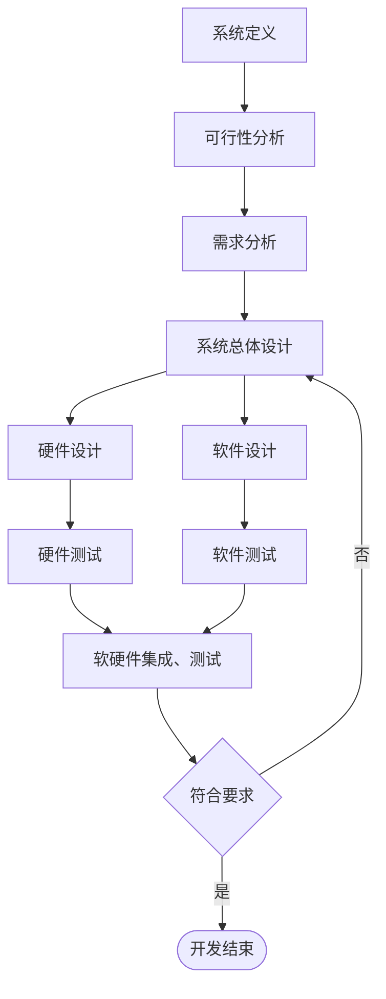

> 嵌入式系统设计与应用 2025 春季学期的回忆版真题整理，来源于[计算机速通之家 | QQ 群号：468081841](https://qm.qq.com/q/ojSHMvHG5a)。
>
> 本文连载于[嵌入式系统设计与应用-2025sp-回忆版 | HeZzz](https://hez2z.github.io/hez-notes/posts/embedded-systems/嵌入式系统设计与应用-2025sp-回忆版).
>
> 答案来源于 GPT-5.5 和 NotebookLM，并由我校对，可能不完全准确，仅供参考。

🙇‍♂️🙇‍♂️🙇‍♂️时间仓促，有不足之处烦请及时告知。[邮箱hez2z@foxmail.com](mailto:hez2z@foxmail.com) 或者在 [速通之家](https://qm.qq.com/q/ojSHMvHG5a) 群里 `@9¾`。

## 一、简答题（共 6 题，每题 5 分）

### 1、简述 ARM 指令集 6 种移位操作各自的作用

LSL：逻辑左移，空出的最低有效位用 0 填充。

LSR：逻辑右移，空出的最高有效位用 0 填充。

ASL：算术左移，由于左移空出的有效位用 0 填充，因此它与 LSL 同义。

ASR：算术右移，算术移位的对象是带符号数，移位过程中必须保持操作数的符号不变。如果源操作数是正数，空出的最高有效位用 0 填充，如果是负数用 1 填充。

ROR：循环右移，移出的字的最低有效位依次填入空出的最高有效位。

RRX：带扩展的循环右移。将寄存器的内容循环右移1位，空位用原来 C 标志位填充.

### 2、简述 S5PV210 中 GPIO 的作用

GPIO（General-Purpose Input/Output Ports）全称是通用编程I/O端口。它们是CPU的引脚，可以通过它们向外输出高低电平，或者读入引脚的状态，这里的状态也是通过高电平或低电平来反应的，所以GPIO接口技术可以说是CPU众多接口技术中最为简单、常用的一种。

每个GPIO端口至少需要两个寄存器:

- 一个是用于控制的“通用I/O端口控制寄存器”
- 一个是存放数据的“通用I/O端口数据寄存器”
  
控制和数据寄存器的每一位和GPIO的硬件引脚相对应，由控制寄存器设置每一个引脚的数据流向，数据寄存器设置引脚输出的高低电平或读取引脚上的电平。

### 3、请说出嵌入式系统有哪 2 种状态寄存器，它们各自有什么作用；请回答现在市面上有哪些主流的 ARM 处理器系列

ARM处理器有两类程序状态寄存器：1 个当前程序状态寄存器 CPSR 和 6 个备份程序状态寄存器 SPSR。

它们的主要功能是：

- 保存最近执行的算术或逻辑运算的信息；
- 控制中断的允许或禁止；
- 设置处理器工作模式。

每一种处理器模式下使用专用的备份程序状态寄存器。

当特定的中断或异常发生时，处理器切换到对应的工作模式下，该模式下的备份程序状态寄存器 SPSR 保存当前程序状态寄存器 CPSR 的内容。

当异常处理程序返回时，再将其内容从备份程序状态寄存器 SPSR 回复到当前程序状态寄存器 CPSR。

目前 ARM 处理器主要分为经典系列和 Cortex 系列：

- 经典系列 (Classic)：
  - ARM7：早期认可度最高的内核，低功耗，常用于 PDA 和低端手机。
  - ARM9/ARM9E：采用 Harvard 架构和 5 级流水线，性能较 ARM7 有显著提升。
  - ARM11：经典家族中性能最强的系列。

- Cortex 系列 (按 A、R、M 划分)：
  - Cortex-A (Application)：面向高性能应用，支持 Linux、Android 等复杂操作系统，常用于智能手机、平板电脑和车载娱乐系统。
  - Cortex-R (Real-time)：面向实时性要求极高的系统，如汽车制动系统和硬磁盘控制器。
  - Cortex-M (Microcontroller)：面向微控制器领域，突出低成本和低功耗，广泛应用于工业控制、传感器和物联网设备。

### 4、简述嵌入式操作系统有哪些作用；嵌入式 linux 操作系统有哪些特点

作用: **屏蔽硬件差异（补平界面）**：隐藏底层硬件的具体细节，为上层应用提供统一、抽象的接口，使开发者无需考虑硬件差异，专注于应用逻辑开发。

特点:

- 具有较长的生命周期;
- 嵌入式系统的目标代码通常是固化在非易失性存储器芯片中;
- 嵌入式系统使用的操作系统一般是实时操作系统（RTOS），系统有实时约束；
- 嵌入式系统需要专用开发工具和方法进行设计；
- 嵌入式微处理器通常包含专用调试电路；
- 嵌入式系统是技术密集、资金密集、高度分散、不断创新的知识集成系统；
- 嵌入式系统通常是面向特定任务的，而不同于一般通用PC计算平台，是“专用”的计算机系统；
- 嵌入式系统运行环境差异很大；
- 嵌入式系统比通用PC系统资源少得多；
- 嵌入式系统“嵌入”到对象的体系中，对对象、环境和嵌入式系统自身具有严格的要求，一般的嵌入式系统具有低功耗、体积小、集成度高、成本低等特点；
- 建立完整的嵌入式系统的系统测试和可靠性评估体系，保证嵌入式系统高效、可靠、稳定工作；

### 5、ARM-Linux 进程调度依据分为哪几个部分

Arm-Linux 选择最值得运行的进程时，其调度依据主要分为以下四个部分：

- **进程调度策略 (Policy)**：用于区分实时进程和普通进程。
- **静态优先级 (Priority)**：进程的初始优先级。
- **动态优先级 (Counter)**：实际意义上的动态优先级，代表进程剩余的时间片（起始值为 priority 的值）。
- **实时优先级 (rt-priority)**：专门针对实时进程的优先级指标。

这些依据共同决定了哪个进程将获得 CPU 资源。既然提到了调度依据，你想进一步了解 Linux 内核中执行调度的核心函数 **`schedule()`** 的具体工作流程吗？

### 6、简述大端存储器组织是什么结构

在大端存储（Big-endian）模式中，数据的低地址存放的是字数据的高字节，而高地址存放的是字数据的低字节。

以 32 位字数据 `0x12345678` 为例，其在大端模式下的分布如下：

- **低地址**：存放 `0x12`（最高字节）
- **次低地址**：存放 `0x34`
- **次高地址**：存放 `0x56`
- **高地址**：存放 `0x78`（最低字节）

这种组织结构可以简记为“**高对低，低对高**”。与之相对的是 ARM 处理器默认常用的**小端模式**（低字节对低地址），需要我对比一下这两者的差异吗？

---

## 二、看语句写作用（共 5 题，每题 2 分）

1. `MRS R1，CPSR`

   作用：将当前程序状态寄存器 `CPSR` 的内容读出，并送入寄存器 `R1`。

   详细说明：

   - `MRS` 的全称可以理解为 Move PSR to Register，即“把状态寄存器内容送到通用寄存器”。
   - 常见用法是：
     - `MRS Rd, CPSR`
     - `MRS Rd, SPSR`
   - 也就是说，它的作用是“读状态寄存器”。
   - 这里的 `CPSR` 是当前程序状态寄存器，里面保存了：
     - 条件标志位；
     - 中断允许/禁止位；
     - 当前处理器工作模式等信息。
   - 在这条语句里：
     - `R1` 是目标寄存器；
     - `CPSR` 是源操作数。
   - 因此这句话的具体作用就是：
     - 把当前 `CPSR` 的值读出来，保存到 `R1` 中，方便后续查看、修改或恢复处理器状态。

2. `ORR R1，[R1,#1]`  

   作用：对 `R1` 的内容按位或上常数 `1`，并将结果保存回 `R1`。

   详细说明：

   - `ORR` 是按位或指令，作用是对两个操作数逐位进行逻辑或运算。
   - 常见用法是：
     - `ORR Rd, Rn, Operand2`
   - 它表示：
     - `Rd = Rn OR Operand2`
   - 本题这条语句按常见考试写法应理解为：
     - `ORR R1, R1, #1`
   - 其中：
     - `R1` 原本保存一个数值；
     - `#1` 表示立即数 1。
   - 因为 1 的二进制最低位是 1，所以把 `R1` 和 `1` 做按位或之后，会产生这样的效果：
     - `R1` 的最低位被强制置为 1；
     - 其他位保持原值不变。
   - 因此在这里，这条语句的具体作用就是：
     - 将 `R1` 的最低位置 1，再把结果写回 `R1`。
   - 这种写法常用于：
     - 设置某个控制位；
     - 打开某个标志位；
     - 对寄存器进行位操作配置。

3. `MSR CPSR,R1`  

   作用：将寄存器 `R1` 中的内容写回当前程序状态寄存器 `CPSR`。

   详细说明：

   - `MSR` 的全称可以理解为 Move to Status Register，即“把数据写入状态寄存器”。
   - 常见用法是：
     - `MSR CPSR, Rm`
     - `MSR SPSR, Rm`
   - 它和上一题的 `MRS` 正好相对：
     - `MRS` 是把状态寄存器读到通用寄存器；
     - `MSR` 是把通用寄存器内容写回状态寄存器。
   - 在这条语句里：
     - `R1` 中保存着准备写入的状态值；
     - `CPSR` 是被修改的目标状态寄存器。
   - 因此这条语句的具体作用就是：
     - 把 `R1` 中的内容写入 `CPSR`，从而恢复或改变当前处理器状态。
   - 它通常可用于：
     - 恢复先前保存的状态；
     - 修改中断使能位；
     - 改变条件标志位；
     - 切换处理器模式。

4. `BLX FUNC1`  

   作用：带链接跳转到子程序 `FUNC1` 执行，并可根据目标状态切换指令集状态。

   详细说明：

   - `BLX` 可以拆开理解：
     - `BL` 是 Branch with Link，表示“带返回地址保存的跳转”；
     - `X` 表示在跳转时还可能发生指令集状态切换。
   - 常见用法是：
     - `BLX label`
     - `BLX Rm`
   - 它的核心作用有两个：
     - 跳转到目标子程序执行；
     - 把返回地址保存到 `LR`（即 `R14`）中。
   - 这样子程序执行完后，就可以通过 `BX LR` 等方式返回调用点。
   - 与普通 `B` 指令不同：
     - `B` 只是单纯跳转；
     - `BLX` 既跳转又保存返回地址，还可能切换 ARM/Thumb 状态。
   - 在这里，这条语句的具体作用就是：
     - 调用子程序 `FUNC1`；
     - 同时把当前下一条指令地址保存到 `LR` 中；
     - 如有需要还会切换到目标函数对应的指令集状态执行。

5. `STRH R4，[R1,R2]!`  

   作用：将寄存器 `R4` 的低 16 位数据作为半字存入由 `R1 + R2` 形成的内存地址中，并把更新后的地址写回 `R1`。

   详细说明：

   - `STRH` 是 Store Register Halfword，表示“存储半字”。
   - 半字的长度是 16 位，也就是 2 个字节。
   - 常见用法是：
     - `STRH Rd, [Rn]`
     - `STRH Rd, [Rn, #offset]`
     - `STRH Rd, [Rn, Rm]!`
   - 本题中的 `[R1, R2]!` 属于基址加偏移寻址，并带写回功能：
     - 有效地址 = `R1 + R2`
     - `!` 表示写回，即访存后把新地址写回基址寄存器
   - 在这条语句里：
     - 被存入内存的数据来自 `R4` 的低 16 位；
     - 存储地址由 `R1 + R2` 计算得到；
     - 执行完后 `R1` 会更新为 `R1 + R2`。
   - 因此它的具体作用可以分成三步理解：
     1. 先计算目标地址 `R1 + R2`；
     2. 把 `R4` 的低 16 位写到该地址中；
     3. 再把这个更新后的地址写回 `R1`。
   - 这种写法常用于：
     - 数组或缓冲区访问；
     - 连续写入多个半字数据；
     - 带指针自增效果的存储操作。

---

## 三、程序题（共 2 题，第一题 5 分，第二题 12 分）

### 1、给你一段冒泡排序程序挖空，让你填 5 个空

**题目**：无符号数据字块存储在 0x400004，无符号数据字块数目字存储在 0x400000

（回忆者注:别问我为什么要用这么复杂的表述方法，我当初看了半天才看懂这是讲的什么，你们也必须感受我的痛苦！/(ㄒ oㄒ)/~~）

**代码如下**：

```armasm
AREA  SORT，CODE，READONLY
ENTRY
START
MOV  R1，#0x400000
LP     SUBS  R1，R1，#1
       BEQ  EXIT
       MOV  R7，R1
       LDR  R0，= [填空 1]
LP1    LDR  R2，[R0]，#4
       LDR  R3，[R0]
       CMP  R2，R3
       [填空 2]
       [填空 3]
       SUBS R7，R7，#1
       BNE  [填空 4]
       B  [填空 5]
EXIT   END
```

**答案**：

- （1）`0x400004`
- （2）`STRLO  R3，[R0,#-4]`
- （3）`STRLO  R2，[R0]`
- （4）`LP1`
- （5）`LP`

详细说明：

这道题本质上是在考：

1. 冒泡排序的基本思想；
2. ARM 汇编中的循环结构；
3. 条件执行指令；
4. 数组顺序访问时的地址更新方式。

#### 程序整体功能

这段程序的作用是：  
对存放在内存中的一组无符号数进行冒泡排序。

- `0x400000` 这个地址中存放的是“数据个数”；
- `0x400004` 开始存放真正的数据内容；
- 程序通过两层循环不断比较相邻两个数；
- 如果前一个数大于后一个数，就交换它们；
- 这样经过多趟扫描后，整个数据块变成有序。

#### 每条关键语句的作用

##### `MOV R1, #0x400000`

- `MOV` 是数据传送指令；
- 这里的作用是把地址 `0x400000` 装入 `R1`。
- 按题目本意，后续外层循环会使用这个值来控制比较趟数。

##### `SUBS R1, R1, #1`

- `SUB` 是减法，`S` 表示更新条件标志位；
- 这里的作用是让 `R1 = R1 - 1`，同时更新零标志位等状态信息；
- 这样下一条 `BEQ` 才能根据结果决定是否退出。

##### `BEQ EXIT`

- `BEQ` 表示“若相等则跳转”；
- 实际上它是根据上一条指令设置的零标志位来判断；
- 如果 `R1 - 1 = 0`，就说明外层循环结束，程序跳到 `EXIT`。

##### `MOV R7, R1`

- 把外层循环当前次数复制给 `R7`；
- `R7` 用作内层循环计数器；
- 也就是每一趟冒泡都要做若干次相邻比较。

##### `LDR R0, =0x400004`

- `LDR` 在这里是伪指令，用来加载一个常数地址；
- 它把数据区起始地址 `0x400004` 送入 `R0`；
- 也就是说，`R0` 从这里开始依次访问待排序数组。

#### 为什么填空 1 是 `0x400004`

因为题目已经说明：

- `0x400000` 处存的是数据个数；
- 真正的数据块从 `0x400004` 开始。

所以 `R0` 要指向第一个数据单元，填：

- `0x400004`

##### `LDR R2, [R0], #4`

- `LDR` 是加载一个字；
- `[R0], #4` 是后变址寻址；
- 含义是：
  1. 先取出 `R0` 当前地址中的数据到 `R2`；
  2. 再把 `R0 = R0 + 4`。
- 由于每个字占 4 字节，所以这相当于读取当前元素后，指针移动到下一个元素地址。

##### `LDR R3, [R0]`

- 读取当前 `R0` 所指向地址中的内容到 `R3`；
- 因为前一句已经把 `R0` 后移 4 个字节，所以这里读到的是“下一个元素”。

因此，这两句合起来的作用是：

- `R2` 取前一个元素；
- `R3` 取后一个相邻元素。

##### `CMP R2, R3`

- `CMP` 是比较指令；
- 本质上相当于做 `R2 - R3`，但不保存结果，只更新条件标志位；
- 后面的条件执行语句就根据比较结果决定是否交换。

#### 为什么填空 2 是 `STRLO R3, [R0,#-4]`

- `STR` 是存储一个字；
- `LO` 是条件后缀，表示“无符号小于”条件成立时执行；
- 这里 `CMP R2, R3` 之后，如果满足交换条件，就需要把较小的数放到前面。

`[R0,#-4]` 的含义是：

- 当前 `R0` 指向的是后一个元素；
- `R0 - 4` 就是前一个元素的位置。

所以：

- `STRLO R3, [R0,#-4]`

表示：

- 当满足条件时，把 `R3` 的值写回前一个位置。

也就是说：

- 把两个相邻元素中更合适放前面的那个数写到前一个单元。

#### 为什么填空 3 是 `STRLO R2, [R0]`

这句与上一句配合完成交换：

- `R0` 当前指向后一个元素的位置；
- `R2` 是原来的前一个元素。

所以：

- `STRLO R2, [R0]`

表示：

- 当满足条件时，把 `R2` 写到后一个位置。

这样两句一起就完成了相邻两个元素的交换。

#### 为什么填空 4 是 `LP1`

##### `SUBS R7, R7, #1`

- 内层循环计数器减 1；
- 同时更新标志位。

##### `BNE LP1`

- `BNE` 表示“不等于 0 就跳转”；
- 只要 `R7` 还没有减到 0，就继续回到内层循环。

因此填空 4 应该是：

- `LP1`

表示继续做下一次相邻元素比较。

#### 为什么填空 5 是 `LP`

当内层循环结束后，说明一趟冒泡完成了。  
此时应返回外层循环，开始下一趟扫描。

所以：

- `B LP`

表示回到外层循环入口继续执行。

因此填空 5 应该是：

- `LP`

#### 这段程序的执行逻辑

可以按下面顺序理解：

1. 外层循环控制总共要做多少趟冒泡；
2. 每一趟开始时，把数组首地址重新装入 `R0`；
3. 内层循环每次取出两个相邻元素：
   - 前一个放入 `R2`
   - 后一个放入 `R3`
4. 比较 `R2` 和 `R3`；
5. 如果需要交换，就把它们写回相反的位置；
6. 内层循环结束后，完成一趟冒泡；
7. 外层循环继续，直到所有数据有序。

#### 考场可直接写的简洁版

这段程序实现的是冒泡排序。  
`0x400000` 存数据个数，`0x400004` 开始存数据内容，所以填空 1 为 `0x400004`。  
程序每次取出两个相邻元素到 `R2` 和 `R3` 中比较，若满足交换条件，则用 `STRLO R3,[R0,#-4]` 和 `STRLO R2,[R0]` 交换两者位置，所以填空 2、3 如上。  
内层循环结束后跳回 `LP1` 继续比较，因此填空 4 为 `LP1`；一趟结束后返回外层循环 `LP`，因此填空 5 为 `LP`。

### 2. 给定一个初始地址为 0x400000 的有 100 个单元的有符号字符串，要求将字符串内部所有的所有大写字母转为小写字母，其他字符不变；(要求使用汇编语言)

参考答案：

```armasm
AREA FUNC1, CODE, READONLY
ENTRY
START
    LDR   R0, =0x400000      ; R0 指向字符串首地址
    MOV   R1, #100           ; R1 作为循环计数器
    MOV   R2, #'A'           ; 大写字母下界
    MOV   R3, #'Z'           ; 大写字母上界
    MOV   R5, #32            ; 'a' - 'A' = 32

LOOP
    LDRB  R4, [R0]           ; 读当前字符
    CMP   R4, R2
    BLT   NEXT               ; 小于 'A'，不是大写字母
    CMP   R4, R3
    BGT   NEXT               ; 大于 'Z'，不是大写字母
    ADD   R4, R4, R5         ; 转为小写
    STRB  R4, [R0]           ; 写回原地址

NEXT
    ADD   R0, R0, #1         ; 指向下一个字符
    SUBS  R1, R1, #1         ; 计数减 1
    BNE   LOOP               ; 未处理完则继续

STOP
    B     STOP
END
```

详细说明：

这道题主要考查：

1. 字符串逐字节访问；
2. ASCII 码范围判断；
3. ARM 中 `LDRB`、`STRB` 的使用；
4. 用循环处理固定长度数组。

#### 程序整体功能

题目要求：

- 从内存地址 `0x400000` 开始；
- 一共有 100 个字符单元；
- 如果某个字符是大写字母 `A~Z`，则改成对应的小写字母；
- 其他字符保持不变。

因此整个程序的思路是：

1. 用一个寄存器保存字符串首地址；
2. 用一个计数器记录还剩多少字符没处理；
3. 每次读出 1 个字节；
4. 判断这个字节是否在 `'A'` 到 `'Z'` 之间；
5. 如果是，就加上 32 变成小写；
6. 写回原地址；
7. 指针后移，继续处理下一个字符。

#### 每条关键语句的作用

##### `LDR R0, =0x400000`

- 把字符串首地址装入 `R0`；
- `R0` 后续作为指针使用，始终指向当前正在处理的字符。

##### `MOV R1, #100`

- `R1` 作为循环计数器；
- 表示总共要处理 100 个字符。

##### `MOV R2, #'A'`

- 把字符 `'A'` 的 ASCII 码送入 `R2`；
- 它是判断大写字母范围的下界。

##### `MOV R3, #'Z'`

- 把字符 `'Z'` 的 ASCII 码送入 `R3`；
- 它是判断大写字母范围的上界。

##### `MOV R5, #32`

- 因为 ASCII 中：
  - `'a' - 'A' = 32`
- 所以只要对大写字母加 32，就能变成对应的小写字母。

##### `LDRB R4, [R0]`

- `LDRB` 表示按字节读取数据；
- 因为字符串按字符存储，每个字符占 1 字节；
- 所以这里必须用 `LDRB`，不能用 `LDR`。

这句的作用是：

- 读出当前字符到 `R4`。

##### `CMP R4, R2`

- 比较当前字符和 `'A'`；
- 如果当前字符比 `'A'` 还小，就不可能是大写字母。

##### `BLT NEXT`

- `BLT` 表示“小于则跳转”；
- 若当前字符小于 `'A'`，直接跳到 `NEXT`，不做转换。

##### `CMP R4, R3`

- 比较当前字符和 `'Z'`；
- 如果当前字符大于 `'Z'`，也不是大写字母。

##### `BGT NEXT`

- `BGT` 表示“大于则跳转”；
- 若当前字符大于 `'Z'`，跳过转换。

因此这两次比较合起来就在判断：

- 当前字符是否属于 `A~Z`。

##### `ADD R4, R4, R5`

- `ADD` 是加法指令；
- 若当前字符是大写字母，就加上 32；
- 这样就得到对应的小写字母。

例如：

- `'A' + 32 = 'a'`
- `'B' + 32 = 'b'`

##### `STRB R4, [R0]`

- `STRB` 表示按字节存储；
- 把转换后的字符写回原来的地址。

##### `ADD R0, R0, #1`

- 指针加 1；
- 因为字符串是逐字节存放的，所以每次处理完一个字符就移动 1 个字节。

##### `SUBS R1, R1, #1`

- 计数器减 1；
- `S` 表示更新标志位；
- 后面的 `BNE` 会用到这个结果。

##### `BNE LOOP`

- 只要 `R1` 还不为 0，就继续循环；
- 直到 100 个字符全部处理完为止。

#### 程序执行逻辑

整段程序可以概括为：

1. 初始化指针、计数器和比较边界；
2. 每次读入一个字符；
3. 判断它是不是大写字母；
4. 如果是，就转成小写并写回；
5. 如果不是，就原样跳过；
6. 指针后移，继续处理；
7. 共处理 100 次后结束。

#### 为什么要用 `LDRB/STRB`

因为这里处理的是“字符串”，本质上是字符数组。

- 一个字符占 1 字节；
- `LDRB` 表示读 1 字节；
- `STRB` 表示写 1 字节。

如果误用 `LDR/STR`，就会按 4 字节读写，破坏字符串内容。

#### 为什么判断范围是 `A~Z`

因为题目要求只把大写字母转成小写，其他字符不变。  
所以必须先判断该字符是否属于大写字母区间：

- 下界：`'A'`
- 上界：`'Z'`

只有处在这个区间内的字符才执行加 32 转换。

#### 回顾

本题可用循环逐字节扫描字符串实现。  
先令 `R0` 指向 `0x400000`，`R1=100` 作为计数器，再以 `R2='A'`、`R3='Z'` 作为判断区间。  
循环中用 `LDRB` 读取当前字符，若字符在 `A~Z` 范围内，则执行 `ADD R4, R4, #32` 将其转为小写，再用 `STRB` 写回；否则保持不变。  
每次处理完后 `R0` 加 1，`R1` 减 1，直到 100 个字符全部处理完成。

---

## 四、回答题（共 4 题，每题 5 分）

### 1、简述嵌入式系统硬件基本结构；简述嵌入式系统软件的基本结构

根据提供的资料，嵌入式系统的硬件与软件基本结构如下：

#### 1. 硬件基本结构

嵌入式硬件以**嵌入式处理器**为中心，通过数据线、地址线和控制信号连接以下核心部件：

- **存储器**：用于存放程序和数据（如 RAM、ROM、Flash）。
- **I/O 接口及设备**：实现人机交互（如键盘、触摸屏、LCD、LED）。
- **通信模块**：负责数据交换（如 RS-232、USB、以太网、WiFi）。
- **电源及辅助设备**：提供电力支持并辅助系统运行。
其特点是配置精简、可根据需求进行“裁剪”和定制化。

#### 2. 软件基本结构

嵌入式软件通常由四个层面组成，从底层到高层依次为：

- **设备驱动层**：直接操作硬件，屏蔽底层差异。
- **实时操作系统 (RTOS)**：提供多任务管理、存储管理、周边资源管理及中断管理等核心服务。
- **应用程序接口 (API) 层**：为上层应用提供标准、统一的调用接口。
- **实际应用层**：实现特定业务功能的最终用户程序。

对于复杂的系统（如 ARM-Linux），还会包含 **BootLoader** 作为开机程序，负责为操作系统准备软硬件环境。

### 2、请说出 BootLoader 的作用

BootLoader 是嵌入式系统的**开机引导程序**，其核心作用是为操作系统或后续程序的运行准备好**软硬件环境**。

具体职责包括：

- **初始化硬件**：配置处理器、系统时钟、内存（DRAM）及必要的外设（如串口、闪存等）。
- **加载内核**：将操作系统镜像从非易失性存储介质（如 Flash 或 SD 卡）复制并解压到 RAM 中。
- **跳转执行**：在准备工作完成后，将 CPU 控制权交给操作系统内核。

它在功能上对应于通用 PC 中的 **BIOS**，是系统加电复位后 CPU 执行的第一段程序。

### 3、请简要说明嵌入式协同设计开发流程



嵌入式协同设计开发流程是一个迭代的过程，主要包括以下阶段：

1. **前期准备**：
    - **系统定义**：提出目标系统的初步方案。
    - **可行性分析**：论证技术与经济上的实现可能。
    - **需求分析**：确立系统必须满足的功能与性能指标。
2. **核心决策**：
    - **系统总体设计**：这是整个流程的分水岭。在此阶段进行**软硬件划分**（确定功能由电路还是代码实现）、处理器选型及操作系统选择。
3. **并行设计与单元测试**：
    - **硬件/软件设计**：根据划分结果，两个团队**独立且并行**地开展工作。
    - **硬件/软件测试**：分别对设计出的单板或程序进行初步的功能验证。
4. **集成与反馈**：
    - **软硬件集成、测试**：将两者结合，对整个产品进行全面的**集成测试**。
    - **符合要求判断**：若测试通过，则开发结束；若不符合要求，流程将**回溯到“系统总体设计”**重新调整划分或方案。

这种流程的特点是“先划分、后独立开发”。你想了解**现代协同设计**是如何通过“系统级仿真建模”来减少最后一步回溯风险的吗？

### 4、简述 ARM-Linux 系统调用原理及其作用

ARM-Linux 系统调用是连接用户空间与内核空间的桥梁，其原理与作用如下：

#### 1. 系统调用原理

- **触发机制**：用户态程序通过执行特定的**软件中断指令**（在 ARMv7/Cortex-A8 中为 `SWI` 指令，在 ARM64 中为 `svc` 指令）向内核发出服务请求。
- **模式切换**：执行该指令后，处理器会产生软件中断，从**用户模式**（User）强制切换到**管理模式**（SVC），并跳转到预定义的中断向量地址执行内核代码。
- **参数传递**：内核通过**系统调用号**来识别具体的请求，参数通常存放在通用寄存器（如 R0~R3 或 X0~X5）中传递。
- **状态保存与恢复**：系统会自动将当前状态寄存器（CPSR）备份到备份状态寄存器（SPSR），处理完毕后通过 `eret` 或恢复 PC 的指令返回用户态并恢复现场。

#### 2. 系统调用的作用

- **安全性（安全屏障）**：限制用户程序直接访问底层硬件或篡改内核资源，防止因单个应用错误导致系统崩溃。
- **抽象与封装（屏蔽硬件）**：为复杂的硬件操作提供统一接口，开发者无需了解底层硬件细节即可进行文件读写或网络通信。
- **可移植性**：使应用程序与特定硬件解耦，保证软件能在不同的硬件架构上保持兼容。
- **高效资源管理**：允许内核集中管理和优化 CPU、存储等受限资源，提高整体运行效率。
