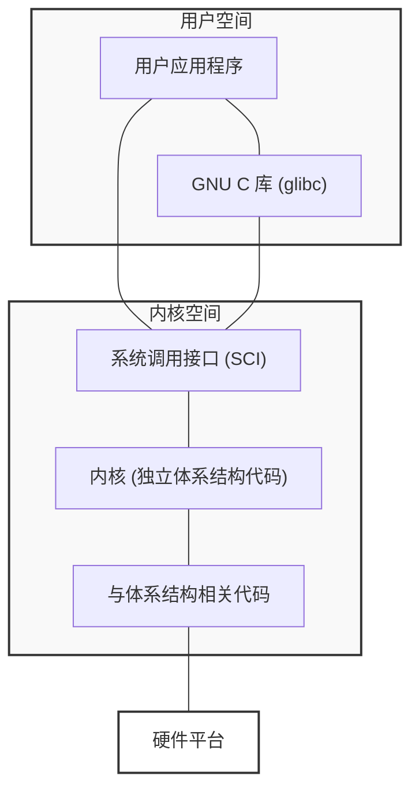
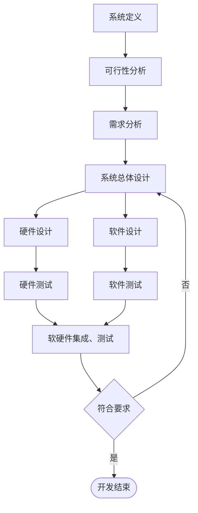

> 嵌入式系统设计与应用 2026 春季学期的期末复习重点。
>
> 本文连载于[嵌入式系统设计与应用-2026sp-重点 | HeZzz](https://hez2z.github.io/hez-notes/posts/embedded-systems/%E5%B5%8C%E5%85%A5%E5%BC%8F%E7%B3%BB%E7%BB%9F%E8%AE%BE%E8%AE%A1%E4%B8%8E%E5%BA%94%E7%94%A8-2026sp-%E9%87%8D%E7%82%B9/).

🙇‍♂️🙇‍♂️🙇‍♂️时间仓促，有不足之处烦请及时告知。[邮箱hez2z@foxmail.com](mailto:hez2z@foxmail.com) 或者在 [速通之家](https://qm.qq.com/q/ojSHMvHG5a) 群里 `@9¾`。

## 题型分布

| 题型          | 数量 | 每题分值 |    总分 | 说明                                                        |
| ------------- | ---: | -------: | ------: | ----------------------------------------------------------- |
| 简答题        |    6 |        8 |      48 | 6 道简答题                                                  |
| 解释 ARM 指令 |    5 |        2 |      10 | -                                                           |
| 程序设计      |    2 |       11 |      22 | 程序填空 ARM 汇编 用 ARM 调用 C C 内嵌汇编调用 ARM |
| 问答题        |    4 |        5 |      20 | -                                                           |
| **总计**      |    — |        — | **100** | 四题型                                                      |

## 重点

### 第一章 嵌入式系统概述

#### 嵌入式系统的特点

- 基本要素和特征

  “嵌入”、 “专用性”、 “计算机”

- **特点**

  - 具有较长的生命周期;
  - 嵌入式系统的目标代码通常是固化在非易失性存储器芯片中;
  - 嵌入式系统使用的操作系统一般是实时操作系统（RTOS），系统有实时约束；
  - 嵌入式系统需要专用开发工具和方法进行设计；
  - 嵌入式微处理器通常包含专用调试电路；
  - 嵌入式系统是技术密集、资金密集、高度分散、不断创新的知识集成系统；
  - 嵌入式系统通常是面向特定任务的，而不同于一般通用PC计算平台，是“专用”的计算机系统；
  - 嵌入式系统运行环境差异很大；
  - 嵌入式系统比通用PC系统资源少得多；
  - 嵌入式系统“嵌入”到对象的体系中，对对象、环境和嵌入式系统自身具有严格的要求，一般的嵌入式系统具有低功耗、体积小、集成度高、成本低等特点；
  - 建立完整的嵌入式系统的系统测试和可靠性评估体系，保证嵌入式系统高效、可靠、稳定工作；

#### 嵌入式系统硬件的基本结构

以嵌入式处理器为中心，配置存储器、I/O 设备、通信模块以及电源等必要的辅助接口组成。

嵌入式系统是“量身定做”的“专用计算机应用系统”，硬件配置非常精简，除了微处理器和基本的外围电路以外，其余的电路都可以根据需要和成本进行“裁剪”、“定制化”，经济、可靠。

#### 嵌入式系统软件的基本结构

设计较复杂的程序时，需要一个操作系统（OS）来管理和控制内存、多任务、周边资源等等。以减少应用程序员的负担。

嵌入式系统软件结构一般包含四个层面：

- 设备驱动层
- 实时操作系统（RTOS）
- 应用程序接口（API）层
- 实际应用程序层

### 第二章 ARM处理器体系结构

#### 经典 ARM 处理器家族及作用

目前 ARM 处理器主要分为经典系列和 Cortex 系列：

- 经典系列 (Classic)：
  - ARM7：早期认可度最高的内核，低功耗，常用于 PDA 和低端手机。
  - ARM9/ARM9E：采用 Harvard 架构和 5 级流水线，性能较 ARM7 有显著提升。
  - ARM11：经典家族中性能最强的系列。

- Cortex 系列 (按 A、R、M 划分)：
  - Cortex-A (Application)：面向高性能应用，支持 Linux、Android 等复杂操作系统，常用于智能手机、平板电脑和车载娱乐系统。
  - Cortex-R (Real-time)：面向实时性要求极高的系统，如汽车制动系统和硬磁盘控制器。
  - Cortex-M (Microcontroller)：面向微控制器领域，突出低成本和低功耗，广泛应用于工业控制、传感器和物联网设备。

#### Cortex-A8 处理器工作模式

Cortex-A8 是基于ARMv7构架的处理器，共有8种工作模式：

| 处理器模式                     | 模式标识符 | 备注                                                           |
| :----------------------------- | :--------- | :------------------------------------------------------------- |
| 用户模式 (User)                | usr        | 正常程序执行模式                                               |
| 系统模式 (System)              | sys        | 使用和用户模式相同的寄存器组，用于运行特权级操作系统任务       |
| 管理模式 (Supervisor)          | svc        | 系统复位或软件中断时进入该模式，是供操作系统使用的一种保护模式 |
| 外部中断模式 (IRQ)             | irq        | 低优先级中断发生时进入该模式，常用于普通的外部中断处理         |
| 快速中断模式 (FIQ)             | fiq        | 高优先级中断发生时进入该模式，用于高速数据传输和通道处理       |
| 数据访问中止模式(Abort)        | abt        | 当存取异常时进入该模式，用于虚拟存储和存储保护                 |
| 未定义指令中止模式 (Undefined) | und        | 当执行未定义指令时进入该模式，用于支持硬件协处理器的软件仿真   |
| 安全监控模式 (Monitor)         | mon        | 可在安全模式和非安全模式下转换                                 |

其中

- User 为用户模式

- User 以外的模式为 非用户模式，或者称为特权模式，

- 除了 User 和 System 以外的模式都可以称为异常模式。

#### ARM 状态寄存器(CPSR 和 SPSR)

ARM处理器有两类程序状态寄存器：1 个当前程序状态寄存器 CPSR 和 6 个备份程序状态寄存器 SPSR。

它们的主要功能是：

- 保存最近执行的算术或逻辑运算的信息；
- 控制中断的允许或禁止；
- 设置处理器工作模式。

每一种处理器模式下使用专用的备份程序状态寄存器。

当特定的中断或异常发生时，处理器切换到对应的工作模式下，该模式下的备份程序状态寄存器 SPSR 保存当前程序状态寄存器 CPSR 的内容。

当异常处理程序返回时，再将其内容从备份程序状态寄存器 SPSR 回复到当前程序状态寄存器 CPSR。

#### 大/小端存储方式

Cortex-A8处理器支持大端（Big-endian）和小端（Little-endian）两种存储模式，同时还支持混合大小端模式（既有大端模式也有小端模式）和非对齐数据访问。可以通过硬件的方式设置（没有提供软件的方式）端模式。

大端模式是被存放字数据的高字节存储在存储系统的低地址中，而被存放的字数据的低字节则存放在存储系统的高地址中。

小端模式中，存储系统的低地址中存放的是被放字数据中的低字节内容，存储系统的高地址存放的是被存字数据中的高字节内容。

例如，一个 32 位字数据 `0x12345678`：

  

    
大端存储模式

    
高字节放低地址，低字节放高地址

    <table style="width:100%;border-collapse:collapse;text-align:center;">
      <tr>
        <td style="padding:6px 8px;;">高地址</td>
        <td style="padding:6px 8px;;">78</td>
      </tr>
      <tr><td style="padding:6px 8px;;"></td><td style="padding:6px 8px;;">56</td></tr>
      <tr><td style="padding:6px 8px;;"></td><td style="padding:6px 8px;;">34</td></tr>
      <tr>
        <td style="padding:6px 8px;;">低地址</td>
        <td style="padding:6px 8px;;">12</td>
      </tr>
    </table>
  

  

    
小端存储模式

    
低字节放低地址，高字节放高地址

    <table style="width:100%;border-collapse:collapse;text-align:center;">
      <tr>
        <td style="padding:6px 8px;;">高地址</td>
        <td style="padding:6px 8px;;">12</td>
      </tr>
      <tr><td style="padding:6px 8px;;"></td><td style="padding:6px 8px;;">34</td></tr>
      <tr><td style="padding:6px 8px;;"></td><td style="padding:6px 8px;;">56</td></tr>
      <tr>
        <td style="padding:6px 8px;;">低地址</td>
        <td style="padding:6px 8px;;">78</td>
      </tr>
    </table>
  

### 第三章 ARM指令集

#### 汇编寻址方式

汇编寻址方式是ARM指令集的核心，决定了指令如何获取操作数。根据提供的资料，主要的寻址方式及其特点如下：

1. 立即寻址 (Immediate Addressing)

    操作数直接在指令中给出，称为立即数，要求以“#”为前缀（十六进制为“#0x”）。

    **示例**：`ADD R0, R0, #1`（R0 = R0 + 1）。

2. 寄存器寻址 (Register Addressing)

    操作数的值存放在寄存器中，指令执行时直接取出寄存器值。

    **特点**：支持在寻址时进行**移位操作**（如LSL逻辑左移、LSR逻辑右移等）。
    **示例**：`MOV R1, R2` 或 `ADD R3, R2, R1, LSR #2`。

3. 寄存器间接寻址 (Register Indirect Addressing)

    寄存器中的值是操作数的**内存地址**，操作数本身存放在存储器中。
    **示例**：`LDR R0, [R1]`（将R1指向的地址中的数据传送到R0）。

4. 基址加偏址寻址 (Base plus Offset Addressing)

    将基址寄存器的内容与指令中给出的地址偏移量（立即数或寄存器）相加，得到有效地址。
    - **模式**：
      - **前变址**：`LDR R0, [R1, #4]`。
      - **自动变址**：`LDR R0, [R1, #4]!`（访问后更新基址寄存器R1 = R1 + 4）。
      - **后变址**：`LDR R0, [R1], #4`（访问后再更新基址）。

5. 堆栈寻址 (Stack Addressing)

    使用专门的堆栈指针（SP/R13）指示操作位置，遵循先进后出（FILO）原则。
    - **类型**：分为满递增（FA）、空递增（EA）、满递减（FD）、空递减（ED）。
    - **规范**：**ATPCS规定使用FD（满递减）类型**，且操作需8字节对齐。
    - **指令**：`STMFD`（入栈）、`LDMFD`（出栈）。

6. 块拷贝寻址 (Block Copy Addressing)

    用于多寄存器传送指令（LDM/STM），实现存储器数据块与多个寄存器之间的数据交换。
    - **后缀**：IA（每次传送后地址加4）、IB（传送前加4）、DA（传送后减4）、DB（传送前减4）。

7. 相对寻址 (Relative Addressing)

    以程序计数器（PC）的当前值为基地址，指令中的地址标号作为偏移量，两者相加得到有效地址。
    - **示例**：`BL NEXT`（跳转到子程序NEXT执行）。

这些寻址方式中，**堆栈寻址（FD）**和**基址加偏址寻址**在程序设计题（如冒泡排序或字符串处理）中非常常用。

#### 第二操作数移位方式(指令中移位)

LSL：逻辑左移，空出的最低有效位用 0 填充。

LSR：逻辑右移，空出的最高有效位用 0 填充。

ASL：算术左移，由于左移空出的有效位用 0 填充，因此它与 LSL 同义。

ASR：算术右移，算术移位的对象是带符号数，移位过程中必须保持操作数的符号不变。如果源操作数是正数，空出的最高有效位用 0 填充，如果是负数用 1 填充。

ROR：循环右移，移出的字的最低有效位依次填入空出的最高有效位。

RRX：带扩展的循环右移。将寄存器的内容循环右移1位，空位用原来 C 标志位填充.

### 第四章 S5PV210微处理器与接口 / Thumb 指令集

#### S5PV210 处理器组成

S5PV210处理器主要由6大部分组成，分别为 CPU 核心、系统外设、多媒体、电源管理、存储器接口和 Connectivity 模块。CPU 和各个部分之间通过多层次 AHB/AXI 总线进行通信。

#### GPIO 接口

GPIO（General-Purpose Input/Output Ports）全称是通用编程I/O端口。它们是CPU的引脚，可以通过它们向外输出高低电平，或者读入引脚的状态，这里的状态也是通过高电平或低电平来反应的，所以GPIO接口技术可以说是CPU众多接口技术中最为简单、常用的一种。

每个GPIO端口至少需要两个寄存器:

- 一个是用于控制的“通用I/O端口控制寄存器”
- 一个是存放数据的“通用I/O端口数据寄存器”
  
控制和数据寄存器的每一位和GPIO的硬件引脚相对应，由控制寄存器设置每一个引脚的数据流向，数据寄存器设置引脚输出的高低电平或读取引脚上的电平。

#### Thumb 指令集

[04-02-第四章Thumb指令集-2026](/hez-notes/pdf/embedded-systems/04-02-第四章Thumb指令集-2026.pdf)

编写程序 ARM 汇编，ARM 调用 C 语言，C 语言调用内嵌汇编

### 第五章 ARM-Linux内核

#### GNU/Linux 操作系统的基本体系结构

用户空间包括用户应用程序和GNU C库（glibc库），负责执行用户应用程序。

内核空间可以进一步划分成 3 层:

- 系统调用接口（System Call Interface），它是用户空间与内核空间的桥梁

- 独立于体系结构的内核代码

- 依赖于体系结构的代码，构成了通常称为板级支持包BSP（Board Support Package）的部分

#### ATPCS 规范

ATPCS （ ARM-Thumb Produce Call Standard）是 ARM 程序和 Thumb 程序中子程序调用的基本规则，目的是为了使单独编译的 C 语言程序和汇编程序之间能够相互调用。这些基本规则包括子程序调用过程中寄存器的使用规则、数据栈的使用规则和参数的传递规则。

### 第十一章 嵌入式系统的开发设计案例

#### 传统的嵌入式系统设计流程

#### 协同设计概念的嵌入式系统设计方法

---

嵌入式系统组成，作用特点，软件和硬件，软件里 Linux 操作系统组成，硬件 S5PV210 内容

ARM-Linux 操作系统基本组成

AEM 处理器 CPSR SPSR 经典类型处理器家族作用

存储器大小端存储方式

六种 指令中 移位

Cortex-A8 处理器工作模式支持处理器类型

汇编寻址方式

嵌入式系统设计方法，传统和现代流程内容

伪代码和伪指令含义操作

ARM 里 ATPCS，堆栈寻址

> notebooklm: [嵌入式系统设计与应用](https://notebooklm.google.com/notebook/f25ae65f-5ddd-460a-8152-9de8ef028f9e)
