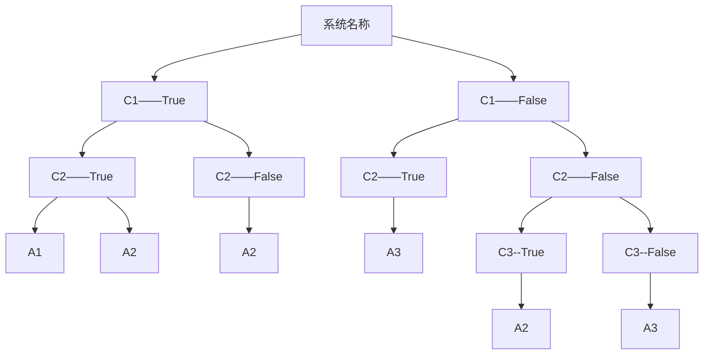

> 软件工程 2025年秋季学期的考试重点,来源于[计算机速通之家 | QQ 群号:468081841](https://qm.qq.com/q/ojSHMvHG5a)。
>
> 本文连载于[软件工程-2025fa-重点| HeZzz](https://hez2z.github.io/2025/12/18/%E8%BD%AF%E4%BB%B6%E5%B7%A5%E7%A8%8B-2025fa-%E9%87%8D%E7%82%B9).

🙇‍♂️🙇‍♂️🙇‍♂️时间仓促,有不足之处烦请及时告知。[邮箱hez2z@foxmail.com](mailto:hez2z@foxmail.com) 或者在 [速通之家](https://qm.qq.com/q/ojSHMvHG5a) 群里 `@9¾`。

> 一共五个大题。ab 卷一样无区别,只是需求不一样。

## 考试概况

考试一共 5 个大题。A 卷和 B 卷题型结构完全一致,只是具体的业务需求描述不同。

## 第一大题:结构化分析与设计(共35分)

**考点**:基于给定的需求描述,绘制 DFD (数据流图)和 H 图(结构图)。

**分值分布**:

- DFD 图占25分
- H 图占10分

**绘图要求**:

- DFD 图通常要求画三层,即顶层图、1层图、2层图

DFD 图符号说明:

1. 加工，功能性，P1，P2(圆形)
2. 实体, Entity, 实际存在的东西(方形)
3. 存储(缺口形)
4. 数据流(箭头)

[16 分钟学会数据流图，结构图，H图](https://www.bilibili.com/video/BV1c84y1p71V/?share_source=copy_web&vd_source=ece2a9c84bf4c011ecb77b7f31228f25)

## 第二大题:逻辑建模(15分)

**考点**:判定树和判定表。

**要求**:根据描述的需求规则说明进行建模。必须同时给出判定树和判定表,且格式必须规范,符合标准形式。

[12 分钟学会判定树判定表](https://www.bilibili.com/video/BV1Wo4y177mq/?share_source=copy_web&vd_source=ece2a9c84bf4c011ecb77b7f31228f25)

[3 分钟搞懂判定树判定表](https://www.bilibili.com/video/BV1QN4y147c6/?share_source=copy_web&vd_source=ece2a9c84bf4c011ecb77b7f31228f25)

判定表:

|     | 1   | 2   | 3   | 4   | 5   | 6   | 7   | 8   |
| --- | --- | --- | --- | --- | --- | --- | --- | --- |
| C_1 | T   | T   | T   | T   | F   | F   | F   | F   |
| C_2 | T   | T   | F   | F   | T   | T   | F   | F   |
| C_3 | T   | F   | T   | F   | T   | F   | T   | F   |
| A_1 | ✓   | ✓   |     |     |     |     |     |     |
| A_2 | ✓   | ✓   | ✓   | ✓   |     |     | ✓   |     |
| A_3 |     |     |     |     | ✓   | ✓   |     | ✓   |

化简后有:

|     | 1   | 2   | 3   | 7   | 8   |
| --- | --- | --- | --- | --- | --- |
| C_1 | T   | T   | F   | F   | F   |
| C_2 | T   | F   | T   | F   | F   |
| C_3 |     |     |     | T   | F   |
| A_1 | ✓   |     |     |     |     |
| A_2 | ✓   | ✓   |     | ✓   |     |
| A_3 |     |     | ✓   |     | ✓   |

判定树:

## 第三大题:UML 用例建模(20分)

**考点**:用例图。

**要求**:根据给出的需求描述进行建模。画出关键元素:

- Actor (参与者)
- 椭圆 (用例)
- 图形关联 (连线及关系)

[6 分钟学会 UML 用例图](https://www.bilibili.com/video/BV1qN41177fw/?share_source=copy_web)

## 第四大题:UML 交互建模(15分)

**考点**:顺序图。

**说明**:这里的需求与第三题(用例图)的需求不同,是全新的需求。题目描述较短(大概四五行文字),难度相对简单。

[5 分钟学会 UML 时序图（顺序图、序列图）](https://www.bilibili.com/video/BV1YM411f7dr/?share_source=copy_web&vd_source=ece2a9c84bf4c011ecb77b7f31228f25)

## 第五大题:软件测试(约15分)

**考点**:等价类划分法设计测试用例。

**解题步骤**:

1. 首先要列出表格,明确列出有效等价类和无效等价类
2. 设计用例时:
   - 每个无效等价类必须设计一个独立的测试用例(一对一覆盖)
   - 有效等价类则设计测试用例以覆盖所有有效条件(通常一个用例可覆盖多个)

[4 分钟搞定黑盒测试等价划分法](https://www.bilibili.com/video/BV1oN4y1B7K9/?share_source=copy_web&vd_source=ece2a9c84bf4c011ecb77b7f31228f25)

[5 分钟学会等价类划分](https://www.bilibili.com/video/BV1YW4y1T7CM/?share_source=copy_web&vd_source=ece2a9c84bf4c011ecb77b7f31228f25)

1. 等价类划分

    | 输入等价类 | 有效等价类 | 无效等价类 |
    | ---------- | ---------- | ---------- |
    | 输入1      | 输入1      | 输入1      |
    | 输入2      | 输入2      | 输入2      |
    | 输入3      | 输入3      | 输入3      |

2. 设计测试用例

    每个测试用例只覆盖一个无效等价类(有效等价类用一个用例覆盖所有条件)  

    | 测试用例  | 结果 | 覆盖                   |
    | --------- | ---- | ---------------------- |
    | 测试用例1 | 成功 | 覆盖有效等价类所有条件 |
    | 测试用例2 | 失败 | 覆盖无效等价类1        |
    | 测试用例3 | 成功 | 覆盖无效等价类2        |
    | 测试用例4 | 失败 | 覆盖无效等价类3        |

